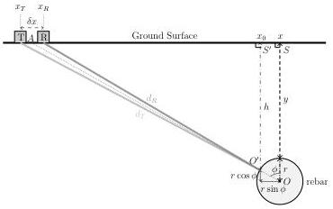

Figure 4.2: Geometry for cylinder detection using ground-coupled common-offset GPR antennas. The cylinder size is exaggerated for clarity.

Here we relax the zero-offset assumption in the ray formulation. In commercial shielded instruments the transmitting and receiving antennas move together with a constant, but non-zero, offset. Figure 4.2 illustrates the problem. The transmitting (T) and receiving (R) antennas are respectively at distances d_T and d_R from the point of beam incidence on the rebar circumference (O') and are placed at x_T and x_R on ground, where |x_T - x_R| = δx is the antenna offset. The rebar with radius r is at horizontal location x and the top of it is at depth y below the surface. Since rebar are often metallic and can be considered as almost perfect electrical conductors, the point of incidence, O' at depth h ≥ y and at horizontal location x_0, plays a critical role in shaping the hyperbolic patterns.

Antennas used in rebar inspection generally have frequencies greater than 1 GHz (due to shallow burial depth and small rebar diameters) and are very small in size (less than several centimeters). Previous authors approximated d_T and d_R as O' leading to equation (4.1). However, for small targets this approximation may approach the time corrections associated with the target radius. Here d_T and d_R are considered explicitly. To calculate d_T and d_R requires O' and φ (the angle between the rebar center and the antenna center). φ is calculated via (4.2) and the depth and position of point O', h and x_0, are obtained via (4.3) and (4.4).

13