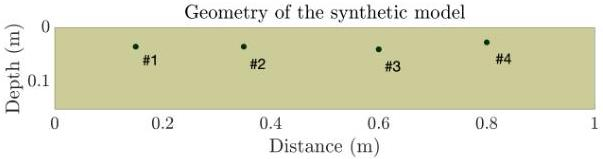
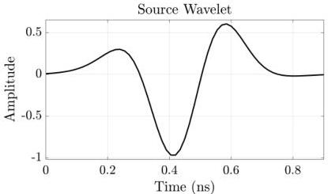

Figure 4.3: Cross section of the 3D geometry model for rebar in homogeneous concrete. Four different rebar are assumed at different depths. 10 cells of Perfectly Matched Layer (PML) on each side are added as absorbents to eliminate the boundary effects.

Figure 4.4: The source wavelet used to create the synthetic GPR data in Figure 4.1 from the model in Figure 4.3 is a Ricker wavelet derivative with $35^{\circ}$ phase rotation.

17