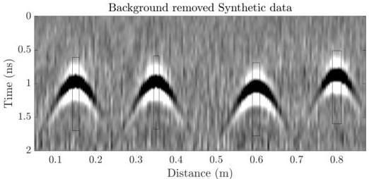

Figure 4.5: Synthetic data from Figure 4.1 after background removal to eliminate the direct wave. Black boxes show sections of the data used to define the initial source wavelet for SBD.

the zero-lag cross-correlation, stacked and normalized (black boxes on Figure 4.5). This results in an initial wavelet whose general shape follows the true wavelet, but the amplitudes of the two positive parts of the signal are clearly under-estimated (Figure 4.6). The SBD process successfully modifies this initial wavelet to a wavelet closer to the true one, although some mismatch remains, presumably due to the effects of noise in the data. The final estimated reflectivity model (Figure 4.6) is a relatively clean representation of the data with the source wavelet removed. The hyperbolic portions of the reflectivity model are then used for the ray-based analysis to determine the initial model. At this stage horizontal locations of the targets are well estimated. However from the ray-based analysis alone, significant errors remain in the estimates of the rebar depth, relative permittivity and conductivity of the concrete and especially the rebar diameters (Table 4.1). On average, the diameter values are estimated with 73% error, with a minimum of 25% and a maximum of 124% error. Variability in the estimated diameters from ray-based analysis is associated with the random noise in the data, which confirms the sensitivity of ra-based results to noise.

The FWI process then improves the estimates of almost all parameters, particularly the diameter values (Table 4.1). The average error in the diameter after FWI is 9.7%, with a

18