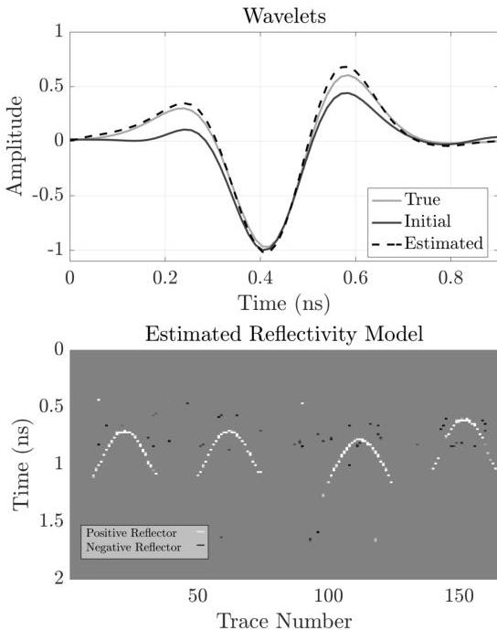

Figure 4.6: Top. True source wavelet from the synthetic model (solid gray line); initial source wavelets estimated from the wavelets captured in the boxes shown in Figure 4.5 (solid black line); and source wavelet estimated from the SBD (dashed black line). Bottom. The estimated reflectivity model of the synthetic data from the SBD. The reflectivity model contains a range of values, the color scale has been flattened for clarity.

19