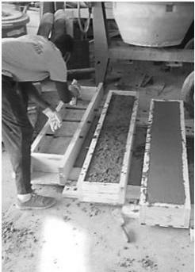
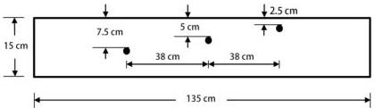

Figure 4.7: Construction of the concrete boxes with rebar.

Figure 4.8: Real data - case 1: schematic cross section of the experimental geometry. Three 19-mm rebar are buried at different depths.

21