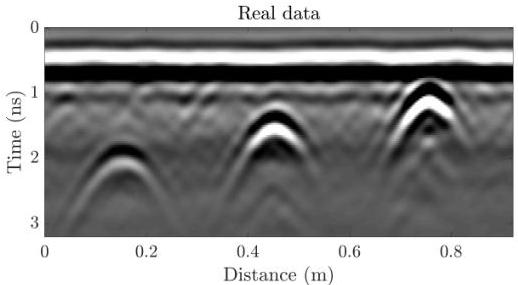

Figure 4.9: Real data - case1, GPR B-scan from a 2.6 GHz antenna over the experiment shown in Figure 4.8. The three bars each produce a distinctive hyperbolic return.

in Figure 4.10). The SBD process alters the shape of the initial wavelet, especially around the tail (Figure 4.11 top). The estimated reflectivity model used to define the initial model for the FWI is shown in Figure 4.11 bottom. From the ray-based analysis, the diameter values are estimated with 35% error, with a minimum of 25% and a maximum of 44% (Table 4.2).

The FWI significantly improves estimates of rebar depths, presumably due to a better $\varepsilon_{concrete}$ estimation. The average error for the estimated diameter values after FWI is 7.2%, with a minimum of 0.1% and a maximum of 11.1%. The conductivity estimate is altered significantly (Table 4.2).

### 4.5.3 Real data, case 2

Seven 10 mm rebar were embedded in a concrete slab, each at a different depth (Figure 4.12 and Table 4.3). Compared to the experiment in case 1, these rebar are approximately half the dimension, and buried over a greater depth range, from 0.5 to 15 cm. A common-offset B-scan was collected using the Noggin 1000 Sensors and Software system with 1 GHz

22