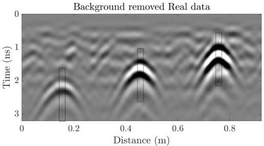

Figure 4.10: Real data - case 1 (as in Figure 4.9) with background removed. Black boxes show sections of the data used to define the initial source wavelet for the SBD.

Table 4.2: The true, ray-based and FWI-estimated parameter values for the experimental data collected using a GSSI 2.6 GHz antenna in the experiment shown in Figures 7-11. x represents the horizontal location in cm, y the depth in cm and d the diameter in mm.  \( \epsilon \)  is unit-less concrete relative permittivity and  \( \sigma \)  is concrete conductivity in mS/m.

|  rebar# | True |   |   | Ray-based |   |   | FWI  |   |   |
| --- | --- | --- | --- | --- | --- | --- | --- | --- | --- |
|   |  x | y | d | x | y | d | x | y | d  |
|  1 | 15 | 2.5 | 19 | 15.34 | 2.2 | 14.3 | 15.02 | 2.42 | 17.02  |
|  2 | 45 | 5.0 | 19 | 44.51 | 4.14 | 27.34 | 45.05 | 5.02 | 19.02  |
|  3 | 76 | 7.5 | 19 | 74.47 | 6.9 | 12.0 | 75.5 | 7.61 | 16.89  |
|  Parameter | True | Ray-based | FWI |   |   |   |   |   |   |
|  \( \bar{\epsilon}_{concrete} \) | - | 5.11 | 4.77 |   |   |   |   |   |   |
|  \( \sigma_{concrete} \) | - | 8.22 | 14.09 |   |   |   |   |   |   |

23