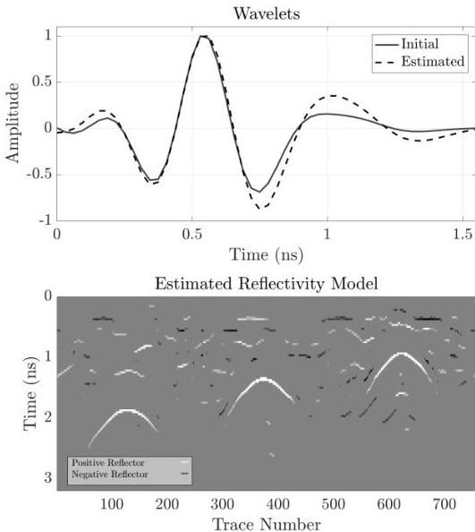

Figure 4.11: Real data - case 1: Top. Initial source wavelet estimated from the data in the boxes shown in Figure 4.10 (solid black line); source wavelet estimated from the SBD (dashed black line) for the 2.6 GHz antenna. Bottom. The estimated reflectivity model from the SBD.

24