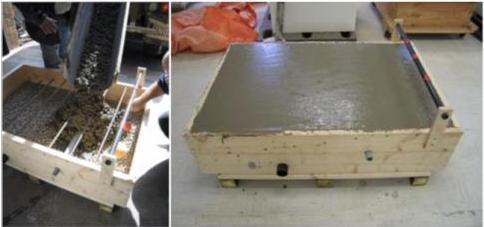

Figure 4.12: Real data - case 2: Construction of the concrete box with seven 10-mm reinforcing bars at depths ranging from 0.5 to 15 cm.

nominal frequency perpendicular to the rebar direction (Figure 4.13). Unlike the case 1 study, the hyperbolas overlap one another at their outer edges.

Similar to the previous case, a standard dewow filter and time-zero correction are applied on the data. High frequency noise, with frequencies greater than 1.6 GHz, is removed from the data using a simple low pass filter.

As for the previous test cases, the wavelet is carefully captured from the data and optimized through the SBD to estimate the source wavelet. The reflectivity model estimated from SBD is similarly used for the ray-based analysis. The ray-based and final FWI results are included in Table 4.3. On average the sizes estimated with the ray-based analysis have 61% error with a minimum of 30% and maximum of 162% error. After the FWI process the average size estimation error is 17% with a minimum of 3% and a maximum of 51% error. The highest errors are found for the deepest targets where amplitudes are lower and signal to noise ratio is poorest.

## 4.6 Discussion and Conclusions

We provide the mathematical expressions for cylindrical targets in common-offset GPR data assuming non-point diffractors and realistic antenna offset, in order to optimize estimates of cylindrical target diameter using ray-based analysis. Travel times for the ray-

25