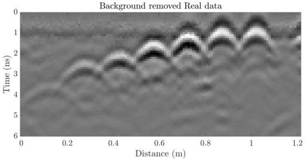

Table 4.3: Real data - case 2. True and estimated positions and diameters of the bars. Rebar numbers start from the left side of the concrete slab shown in Figure 4.12. x represents the horizontal location in cm, y the depth in cm and d the diameter in mm.  \( \epsilon \)  is unit-less concrete relative permittivity and  \( \sigma \)  is concrete conductivity in mS/m.

|  rebar# | True |   |   | Ray-based |   |   | FWI  |   |   |
| --- | --- | --- | --- | --- | --- | --- | --- | --- | --- |
|   |  x | y | d | x | y | d | x | y | d  |
|  1 | 15 | 15 | 10 | 14.9 | 16.8 | 26.2 | 14.9 | 14.6 | 15.1  |
|  2 | 30 | 10 | 10 | 29 | 9.4 | 17.7 | 29.5 | 9.8 | 12.8  |
|  3 | 45 | 7.5 | 10 | 45.1 | 8.2 | 14.2 | 45.1 | 7.6 | 9.7  |
|  4 | 60 | 5 | 10 | 60 | 5.5 | 13.0 | 60 | 5.2 | 10.3  |
|  5 | 75 | 2.5 | 10 | 75.4 | 3.1 | 5.5 | 75.3 | 2.6 | 8.9  |
|  6 | 90 | 1 | 10 | 89.7 | 0.5 | 15.1 | 90 | 0.9 | 10.4  |
|  7 | 105 | 0.5 | 10 | 104.9 | 0.0 | 15.9 | 105.1 | 0.2 | 10.6  |
|  Parameter | True | Ray-based | FWI |   |   |   |   |   |   |
|  \( \bar{\epsilon}_{concrete} \) | - | 6.56 | 5.98 |   |   |   |   |   |   |
|  \( \sigma_{concrete} \) | - | 28.45 | 19.72 |   |   |   |   |   |   |

Figure 4.13: Real data - case 2. GPR B-scan over seven rebar from 15 to 0.5 cm depth shown in Figure 4.12, using Sensors and Software 1 GHz antenna. Background removal is applied to mute the direct wave.

26