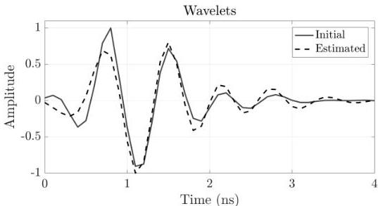
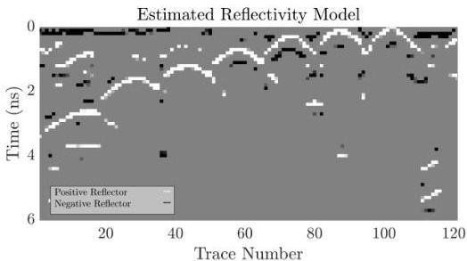

Figure 4.14: Real data - case 2: Top. Initial source wavelet estimated from the data (solid black line); source wavelet estimated from the SBD (dashed black line) for the 1 $GHz$ antenna. Bottom. The estimated reflectivity model from the SBD.

27