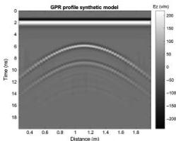

Downloaded 01/15/19 to 131.247.224.4. Redistribution subject to SEG license or copyright; see Terms of Use at http://library.seg.org/

H28

Jazayeri et al.

saturated pipes. Maierhofer et al. (2010) provide a workflow for the typical common-offset GPR data analysis procedures as well as modeling and imaging techniques common to rebar detection. Benedetto and Pajewski (2015) describe examples of GPR surveys in civil engineering, including pavement, bridges, tunnels and buildings, underground utilities, and voids.

The horizontal position of an underground pipe on a GPR profile is readily established as the location of the peak of the characteristic diffraction hyperbola (Figure 1). Inferring the depth to the top of the pipe requires knowledge of the average velocity structure of materials over the pipe. Loeffler and Bano (2004) study the impact of water content on the permittivity and therefore on GPR signals by simulations of cylindrical objects in the vadose zone. One way to derive the propagation velocity in the medium is by conducting a common-midpoint (CMP) or wide-angle reflection and refraction (WARR) survey, in which the spacing between the transmitter and receiver is progressively increased. Following methods derived for stacking seismic data, layer velocities can be determined by semblance analysis (Fisher et al., 1992; Grandjean et al., 2000; Liu and Sato, 2014; Liu et al., 2014). This method has the advantage of recovering information on how velocity varies with depth, but it requires surveys with systems that permit a variable offset between transmitter and receiver. Urban surveys require shielded antennas (to avoid reflections from surficial objects); most shielded systems cover a transmitter-receiver pair in a single shielded unit that does not lend itself to easy acquisition of CMP surveys. Alternatively, an average velocity can be determined from the shape and timing of the diffraction hyperbola that forms the GPR return from the pipe itself. So, in general, the pipe depth is estimated by finding the average velocity that best fits the measured hyperbola. However, Sham and Lai (2016) observe that the curve-fitting method is biased by human judgment. Grandjean et al. (2000), Booth et al. (2011), and Murray et al. (2007) describe the accuracy with which velocities, and hence depths of utilities, can be determined via both methods.

In this paper, we focus on how to extract additional information about pipes, beyond position and depth, from GPR profiles. The

Figure 1. A synthetic GPR profile for an air-filled PVC pipe. The inner diameter of the pipe is 40 cm with a wall thickness of 3 mm; the central frequency of the antenna is 800 MHz. In this case, distinct reflections from the top and bottom of pipe are observed; later, weaker arrivals are multiples.

pipe diameter affects GPR returns, most visibly when the radar wavelength is small compared with the pipe diameter and the pipe's permittivity is significantly different from the surrounding soil (Roberts and Daniels, 1996). In this case, distinct returns can be captured from the top and bottom of the pipe, as shown in Figure 1 (e.g., Zeng and McMechan, 1997). It is easier to capture the dimensions of water-filled pipes than air-filled pipes because the slow radar velocity in water delays the return from the bottom of the pipe by a factor of approximately nine over the equivalent air delay. In either case, when the pipe is narrow enough that the top and bottom returns overlap and interfere, extracting information on pipe diameter from the single hyperbola is challenging. Wincatujanagul et al. (2017) report no significant difference for the hyperbolic reflections for different rebar diameters. Diameter estimation based on fitting hyperbolas is clearly impacted by decisions about the phase of the pipe return selected for the fit (because one can choose either positive or negative phases; see Dou et al., 2017) and trade-offs made in wave velocity and pipe diameter selections. The hyperbola-fitting method also cannot provide any information about the pipe-filling material.

Ristic et al. (2009) present a method to estimate the radius of a cylindrical object and the wave propagation velocity from GPR data simultaneously based on the hyperbola fitting. In their method, the target radius is estimated by extracting the location of the apex of the hyperbola and the soil velocity that best fits the data for a point reflector, followed by finding an optimal soil velocity and target radius, using a nonlinear least-squares fitting procedure. This method is handicapped because the variability in the GPR source wavelet (SW) and local complexities in the soil's permittivity and conductivity structure affect the shape of the returned pulse. This in turn affects how the arrival times of diffracted returns are defined. These perturbations to the arrival time can be on the order of the changes expected with the changing cylinder diameter, making it difficult to distinguish the pipe diameter from the wavelet from the permittivity and conductivity complexities.

Other researchers have also investigated the complexities associated with pipe returns. For example, GPR can be applied for leakage detection from the pipes. Crocco et al. (2009) and Demirci et al. (2012) successfully detect water leakage from plastic pipes using GPR by applying microwave tomographic inversion and a back-projection algorithm, respectively. Ni et al. (2010) use a discrete wavelet transform (DWT) to filter and enhance GPR raw data to improve image quality. They find DWT to be advantageous in the detection of deeper pipes if shallower anomalies obscure the reflected signal from deeper targets, but they do not attempt to extract pipe diameter information. Jamming et al. (2014) present an approach for hyperbola recognition and pipe localization in radargrams, which use an iterative-directed shape-based clustering algorithm to recognize hyperbolas and identify groups of hyperbola reflections that belong to a single buried pipe.

Full-waveform inversion (FWI) can potentially provide high-resolution subsurface images because it uses information from the entire waveform. If achieved, FWI can improve on estimates of pipe diameter made from ray-based arrival time analysis, as in Ristic et al. (2009). Virieux and Operto (2009) provide an overview of the development of this technique for seismic data. FWI on GPR data is most commonly applied on crosshole GPR data to study aquifer material (e.g., Ernst et al., 2007; Klotzsche et al., 2010, 2012, 2013, 2014; Meles et al., 2010, 2012; Yang et al., 2013; Gueting et al.,

38