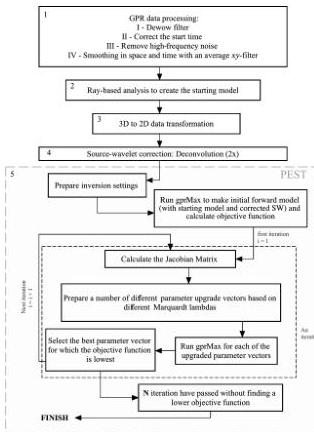

FWI of common-offset GPR using PEST

H29

2015, 2017; van der Kruk et al., 2015; Keskinen et al., 2017) or on frequency-domain air-launched GPR signals for a limited number of model parameters (Lambot et al., 2004; Tran et al., 2014; André et al., 2015; De Coster et al., 2016; Mahmoudzadeh Ardakani et al., 2016). Lavoué et al. (2014) use frequency domain FWI to image 2D subsurface electrical structures on multioffset GPR data. Kalogeropoulos et al. (2011) use FWI on surface GPR data to monitor chloride and moisture content in media. Busch et al. (2012, 2014) apply FWI on surface GPR data to characterize soil structure and to obtain conductivity and permittivity estimations. Busch et al. (2013) further apply FWI on surface GPR data to estimate hydraulic properties of a layered subsurface.

The method described in this paper builds on the previous work by applying the FWI method to the problem of pipe diameter and infilling material estimation. Multiple variables that influence the GPR diffraction hyperbola can be incorporated into the inversion process. Here, the method is assessed when the SW, average soil permittivity, pipe depth and horizontal position, pipe inner diameter, and pipe-filling material are optimized in the inversion. The method in its current state is only effective with diffraction(s) from one pipe, and it does not yet share the advantages of Ni et al. (2010) and Janning et al. (2014) methods that can distinguish multiple pipes.

We note that we are considering only an exceptionally simple case that provides a starting point for more thorough investigations. We only consider transects run perpendicular to a horizontal pipe with antennas in broadside mode (maintained parallel to the pipe and perpendicular to the transect). Polarization effects on surveys oblique to pipes will be quite different (e.g., Vilela and Romo, 2013).

## METHOD

The method presented here for determining a best-fitting pipe diameter and other parameters involves five main steps (Figure 2): (1) basic processing of the raw GPR data, (2) defining the starting model using the ray-based diffraction hyperbola analysis, (3) transformation of 3D data to 2D, (4) finding a good effective SW, and (5) an iterative inversion process that runs to a threshold criteria to find the pipe diameter that best fits the data. The starting model created in step 2 is defined using ray-based analysis of the data, whereby the average soil velocity and therefore electrical permittivity, soil electrical conductivity, pipe lateral location, and depth are estimated. In this workflow, the user must assume a permittivity of the pipe-filling material (e.g., a value expected for air, water, or sewage) and the pipe material (e.g., PVC) and pipe wall thickness. With these assumptions, a value for the electrical conductivity within the pipe and a starting estimate of the pipe diameter are also derived.

The inversion procedure in step 5 requires forward modeling of GPR wave propagation. Because forward modeling of 3D waves is computationally expensive, 2D forward modeling is used. This requires a 3D to 2D transformation on the data, accounting for the expected differences between the real source and a line source, and correcting the geometric spreading factor.

We note that the goals of the method described here are to improve the initial estimates of pipe diameter and pipe-filling material and soil permittivity. Estimating the conductivity of the pipe-filling material (or soil) would require further computational expense, in the form of updating the SW estimation (step 4) at each iteration of the inversion process in step 5. Here, the conductivity values are estimated from ray theory and then fixed during the inversion process. To eliminate errors caused by inaccurate conductivity values,

Figure 2. The inversion process flowchart. The critical steps prior to the PEST full waveform inversion (gray box) are (1) simple GPR data processing, (2) ray-based analysis to estimate the initial model, (3) 3D to 2D transformation, (4) source-wavelet correction(s); and (5) creation of a reasonably good initial model using the ray-based results and the estimated SW, starting the inversion.

Downloaded 01/15/19 to 131.247.224.4. Redistribution subject to SEG license or copyright; see Terms of Use at http://library.seg.org/

39