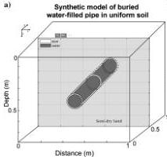
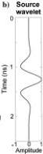
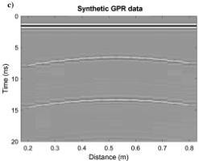

Downloaded 01/15/19 to 131.247.224.4. Redistribution subject to SEG license or copyright; see Terms of Use at http://library.seg.org/

H32

Jazayeri et al.

## RESULTS AND DISCUSSION

### Synthetic model

This inversion method is evaluated by creating a 3D synthetic model of a PVC pipe filled with fresh water and buried 35 cm in homogeneous semi-dry sand (Figure 3a; Table 1). The model is used to generate synthetic 3D GPR readings. The GPR data set (Figure 3c) is created assuming a common-offset survey with an 800 MHz antenna set with 14 cm spacing between transmitter and receiver. Every 5 cm, a pulse is transmitted and received, with 12 traces in total. The synthetic waveform is a fourth derivative of the Gaussian waveform, similar to those of some commercial systems (Figure 3b). The cell size in the gprMax 3D forward model is 1 × 1 × 1 mm.

The ray-based analysis is applied to the synthetic GPR data (Figure 3c) assuming the pipe to be water filled. The ray-based analysis estimates the diameter with 15% error (Table 1). In contrast, an air-filling assumption results in an approximately 10%–30% error in diameter estimation. Lateral position and soil average permittivity and conductivity are well-estimated using the ray-based analysis (Table 1). The 3D to 2D transformation is applied, and the transformed data are then treated as the “observed data” in the inversion process.

A uniform soil permittivity, a uniform effective soil conductivity, a uniform effective in-filling conductivity, and the pipe lateral position and depth are set following the methods described above. Therefore, the unknown parameters in the inversion process are defined to be uniform soil and pipe-filling permittivities, pipe depth,

Figure 3. (a) Model geometry for a PVC pipe containing fresh water embedded in semi-dry sand. The pipe inner and outer diameter are 10 and 10.6 cm, respectively. The colored cross sections show the part of the model over which the antenna has moved. (b) The 800 MHz fourth derivative Gaussian wavelet assumed for the GPR signal. (c) The GPR profile produced by synthesizing readings every 5 cm across the model. The circles show the arrival-time picks used in the ray-based inversion. The white lines show the arrival-time curves predicted form the ray-based inversion parameters.

Table 1. The correct, initial guess, and inverted parameter values for the synthetic model. Pipe diameter estimate is significantly improved by the inversion process. Soil conductivity and pipefilling conductivity are fixed to the ray-based results during FWI.

|  Case | Parameter | Correct value | Ray-based estimation | FWI result with the ray-based results as the starting model | Estimation error (%)  |
| --- | --- | --- | --- | --- | --- |
|  Synthetic model of the water-filled pipe | Relative permittivity of the soil | 5 | 5.1 | 5.09 | 1.8  |
|   |  Electrical conductivity of the soil (mS/m) (fixed) | 2 | 2.3 | — | —  |
|   |  Relative permittivity of pipe-filling material (water) | 80 | 80 | 78.5 | 2.25  |
|   |  Electrical conductivity of pipe-filling material (water) (mS/m) | 1 | 2.5 | — | —  |
|   |  X (center of the pipe) (cm) | 50 | 49.95 | 49.95 | 0.1  |
|   |  Depth of the top of the pipe (cm) | 35 | 33.65 | 35.08 | 0.23  |
|   |  Pipe wall thickness (mm) (fixed) | 3 | — | — | —  |
|   |  Pipe inner diameter (cm) | 10 | 11.5 | 10.12 | 1.2  |
|   |  Pipe relative permittivity (PVC) (fixed) | 3 | — | — | —  |
|   |  Pipe electrical conductivity (mS/m) (PVC) (fixed) | 10 | — | — | —  |

42