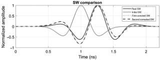
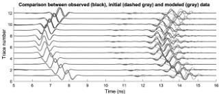
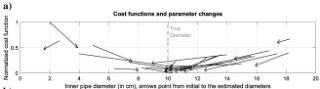
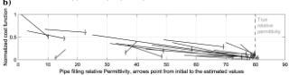

Downloaded 01/15/19 to 131.247.224.4. Redistribution subject to SEG license or copyright; see Terms of Use at http://library.seg.org/

FWI of common-offset GPR using PEST

H33

and inner diameter. In this scenario, the pipe is assumed to be known to be constructed with PVC of typical wall thickness (3 mm), and the pipe permittivity and conductivity are set to values appropriate for PVC (see Table 1). To mimic the inversion process in which the SW is not known, an initial guess of a Ricker wavelet is applied as the SW (Figure 4) and a synthetic 2D model is generated using the ray-based estimated model and the Ricker wavelet. For the wavelet estimation, the direct air and ground wave are excluded. With the deconvolution method, the model SW is corrected (see Figure 4, the first corrected SW). The synthetic data are again calculated with the first corrected wavelet. At the last step of the SW correction, the wavelet is deconvolved again using the second synthetic data and the observed data (e.g., Klotzsche et al., 2010). In this process, the symmetric Ricker shape wavelet is altered to a nonsymmetric form closer to the real wavelet.

Because the ray-based results are good approximations of the "true" model parameters, Figure 5 illustrates that the effective SW correction alone produces a good fit between the hyperbola from the top of the pipe of the observed and modeled GPR traces. The inversion procedure for the soil and pipe properties and dimensions then brings improved alignment of the bottom of pipe diffraction returns (Figure 5) and reduces errors (Table 1). For instance, the ray theory estimated the pipe inner diameter to be 11.5 cm, whereas the FWI process improved this estimate model parameter to 10.12 cm (1.2% error). The estimated depth also shows an improvement after the FWI process.

To study the effect of the initial value selection on the FWI results, the FWI process was run 22 times for this case, in each case varying the permittivity of the pipe filling material and pipe diameter as initial model parameters. In each case, the effective SW is computed with the model medium properties. The initial values were specified in 15 cases by randomly varying values in a Gaussian distribution around the best fit inversion results of Table 1 with a standard deviation of 50% of the ray-based result and then in seven cases by randomly assigning more extreme outliers to selected parameters (a comprehensive examination of all five inversion parameters was computationally not feasible and is outside the scope of this paper). Figure 6 summarizes the changes in cost function from the initial value to the final inversion value for all runs, for the pipe inner diameter (Figure 6a) and the pipe-filling relative permittivity (Figure 6b). Note that only the first and last steps of the inversion process are shown as the tail and tip of the arrows; the successive changes in parameters through multiple iterations are not shown.

Figure 4. The real SW used to create 3D model (black), initial SW used in the synthetic model (gray); the first (light dashed gray), and second corrected effective SW pulse (dark dashed gray). The amplitudes are normalized.

Figure 5. Comparison of observed true synthetic GPR traces (black), the GPR traces predicted from the initial model and corrected SW (dashed), and the GPR traces predicted from the final inverted model (gray). Traces are normalized individually.

Figure 6. Cost function values associated with the initial guess (tail of arrow) and the inversion output (tip of the arrow) for 22 runs. Note that in each run, the initial values of the other variables in the inversion also vary. (a) The cost function changes with the inner pipe diameter. The dashed gray line marks the true (simulated) 10 cm pipe inner diameter. (b) The cost function changes with the infilling relative permittivity. The dashed gray line marks the true pipe filling relative permittivity of 80. With starting values of pipe diameter within a factor of two of the correct value, the inversion improves the estimate of the pipe diameter. The bold gray arrows show the inversion run with starting parameters from the ray-based analysis, listed in Table 1.

43