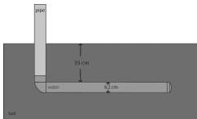
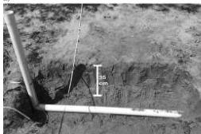
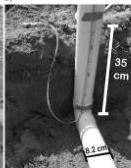
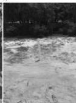

Downloaded 01/15/19 to 131.247.224.4. Redistribution subject to SEG license or copyright; see Terms of Use at http://library.seg.org/

H34

Jazayeri et al.

Figure 6a shows that the diameter estimates are improved for all starting values within a factor of two of the true value. Many initial models converge at a 1–2 mm overestimate of the pipe diameter, but the ray-based analysis starting model yields a final diameter only 0.12 mm greater than the true value, a difference less than the 1 mm cell size in the forward models. From Figure 6b, it can be concluded that inversions starting with significantly lower initial assigned in-filling relative permittivity values (<50) and initial pipe diameters that differed from the true diameter by more than 50% failed to reach within 10% of the true value. Lower initial pipe-filling relative permittivities (≤50) also significantly increased the time for convergence. We defer more detailed discussion of starting models to the more realistic field case studies described below.

The synthetic model results above show that this FWI method is effective for improving estimates of pipe dimensions in highly idealized conditions. The effects of realistic soil heterogeneities are missing. In the following section, results of the method in real-world but well-controlled scenarios are presented.

### Case studies of PVC pipe in well-sorted sands

The inversion method was tested with GPR profiles run across a buried PVC pipe of known position and dimensions. The field tests were run in the Geopark of the University of South Florida in Tampa, Florida, USA (Vacher, 2017). There, the uppermost 1–2 m consist of well-sorted loose sand over progressively more silty and clay-rich layers (e.g., Bumpus and Kruse, 2014).

In mid-May 2016, several reconnaissance GPR profiles were collected to find an area with few tree roots and low degree of soil disturbance. Once a preferred location was found, a trench was excavated to bury a PVC pipe (Figure 7). The selected PVC pipe has an outer diameter of 8.2 cm and a wall thickness of 3 mm, and it was placed so that the top of the pipe lay 35 cm below the ground surface. One end of the horizontal PVC pipe was closed with a PVC lid, and the other end was connected to another vertical pipe through a 90° PVC elbow. The “L”-shaped pipe was designed to enable researchers to fill the pipe with liquids (Figures 7a, 7b, and 8). Once the burial depth of the top of the pipe was confirmed to be the same at the elbow location and the lid, the trench was refilled. Before refilling with the native sand, the sand was sieved to remove small

tree roots. Attempts were made to make sure that the soil was as uniformly distributed as possible above the pipe to increase the chances of receiving clear diffracted hyperbolas.

Two subsequent GPR surveys were performed. The first was run on the empty, air-filled pipe on the same day the pipe was buried. The second was run almost six weeks later, in late July 2016. Although the soil was quite dry on the day of the July survey, there had been heavy rains in the six weeks since the pipe was installed, so it is assumed that the soil over the trench had settled and compacted to a degree more similar to undisturbed neighboring soil. For this second survey, the pipe was completely filled with fresh water. In this paper, we discuss the July water-filled pipe survey first because the data interpretation is more straightforward.

### Case study 1: Water-filled pipe

After the pipe was filled with water, as illustrated in Figure 8, a grid of 15 parallel profiles was acquired, with 5 cm spacing between profiles (a subset is shown in Figure 9). All profiles were run in a north–south direction, perpendicular to the pipe that was laid in an east–west direction. A Mala-ProEx system with 800 MHz shielded antennas was used. The spacing between traces along each profile was set to 8.5 mm and was controlled by an odometer wheel that

Figure 8. Schematic sketch of the pipe buried in sand. The moderate gray color shows the water level in the pipe.

a)

b)

c)

Figure 7. (a) The L-shaped PVC pipe in the hole in sand. (b) The elbow part of the pipe showing the burial depth of 35 cm for the top of the horizontal part. (c) After filling the hole, the vertical part is visible that enables filling the pipe. The horizontal part of the pipe is aligned between the pink flags.

44