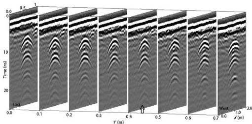

FWI of common-offset GPR using PEST

H35

Downloaded 01/15/19 to 131.247.224.4. Redistribution subject to SEG license or copyright; see Terms of Use at http://library.seg.org/

Figure 9. Profiles of the water-filled pipe buried in sand. The left-most left plot is closest to the pipe elbow; the right-most right plot is closest to the lid. Diffracted hyperbolas are recorded from the top and bottom of the pipe, at all locations. The arrow shows the profile used for FWI.

Table 2. Sample inversion results for air- and water-filled pipes. Ray-based analysis results are used as the initial values in the FWI. Soil conductivity and pipe-filling conductivity are fixed to the ray-based results during FWI.

|  Case | Parameter | Correct value | Ray-based estimation | FWI result with the ray-based results as the starting model | Estimation error (%)  |
| --- | --- | --- | --- | --- | --- |
|  Water-filled pipe | Relative permittivity of the soil | — | 5.822 | 5.85 | —  |
|   |  Electrical conductivity of the soil (mS/m) (fixed) | — | 3.2 | — | —  |
|   |  X (center of the pipe) (m) | 1.09 | 1.088 | 1.09 | 0  |
|   |  Depth of the top of the pipe (cm) | 35 | 33.55 | 34.84 | 0.46  |
|   |  Pipe wall thickness (mm) (Fixed) | 3 | — | — | —  |
|   |  Pipe inner diameter (cm) | 7.6 | 6.8 | 7.59 | 0.13  |
|   |  Relative permittivity of the pipe-filling material (water) | — | 80 | 74 | —  |
|   |  Effective electrical conductivity of pipe-filling material (water) (mS/m) (fixed) | — | 0.02 | — | —  |
|   |  Pipe relative permittivity (PVC) (fixed) | — | 3 | — | —  |
|   |  Pipe electrical conductivity (mS/m) (PVC) (fixed) | — | 1 | — | —  |
|  Air-filled pipe | Relative permittivity of soil | — | 4.52 | 4.6 | —  |
|   |  Electrical conductivity of soil (mS/m) (fixed) | — | 4.23 | — | —  |
|   |  X (center of the pipe) | 1.09 | 1.095 | 1.092 | 0.18  |
|   |  Depth of the top of the pipe (cm) | 35 | 34.7 | 34.8 | 0.57  |
|   |  Pipe wall thickness (mm) (fixed) | 3 | — | — | —  |
|   |  Pipe inner diameter (cm) | 7.6 | Between 3 and 30 | 8.18 (starting value = 12) | 7.6  |
|   |  Relative permittivity of the pipe-filling material (air) | 1 | 1 | 1 | 0  |
|   |  Effective electrical conductivity of the pipe-filling material (air) (mS/m) (fixed) | 0 | — | — | —  |
|   |  Pipe relative permittivity (PVC) (fixed) | — | 3 | — | —  |
|   |  Pipe electrical conductivity (mS/m) (PVC) (fixed) | — | 1 | — | —  |

45