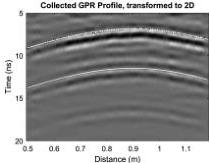
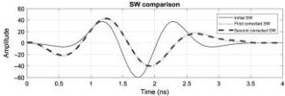
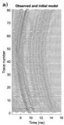
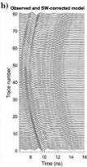
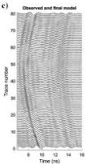

Downloaded 01/15/19 to 131.247.224.4. Redistribution subject to SEG license or copyright; see Terms of Use at http://library.seg.org/

H36

Jazayeri et al.

Figure 10. Profile over the water-filled pipe, direct wave excluded. The first strong return between 7 and 10 ns is the reflection from the top of the pipe; the second return between 12 and 15 ns is from the bottom of the pipe. The latest weak return between 17 and 19 ns is a multiple. The circles show the arrival time picks used in the ray-based inversion. The white lines show the arrival time curves predicted from the ray-based inversion parameters.

Figure 11. The initial and corrected effective SWs. The second corrected SW has an overall shape similar to the fourth Gaussian derivative, but it is not symmetric.

Figure 12. (a) Observed data (black) and initial synthetic data (gray) comparison. (b) The same plot after SW correction; the first reflected signals fit better than the previous model. (c) The same plot after the FWI process. A generally good fit between the observed and modeled data is observed. Traces are normalized individually.

was calibrated on site. The 80 traces centered on the hyperbola were selected to use in the inversion process. The water-filled pipe produces sharp hyperbolas in all the GPR profiles.

For a water-filled pipe, distinct reflections from the top and bottom of pipe are anticipated if the pipe diameter is greater than approximately half the radar wavelength. For this scenario, a wavelength of approximately 4 cm is expected; the pipe diameter of 7.6 cm is almost twice this value. Clear hyperbolas are indeed observed from top and bottom of the pipe in all 15 profiles. The central profile marked by the arrow in Figure 9 has one of the cleanest pipe returns recorded, and it was selected for the FWI.

From the selected profile, the closest 80 traces to the pipe were extracted for the FWI (Figure 9). The optimal data range and trace spacing for inversion is site dependent and outside the scope of this paper. The ray-based analysis was performed on the selected data set (Table 2) followed by the 3D to 2D transformation. Figure 10 presents the 80 traces after basic filtering, including a 4 ns dewow filter, a time-zero correction, a high-cut 1600 MHz frequency filter, an average xy filter with a 3 x 3 window size (this subjectively chosen window size smooths the data slightly, does not generally affect amplitudes on average by more than 1%, and improves the

performance of the inversion process), and a 3D to 2D transformation.

We found that the inversion procedure yields better results if the direct wave arrivals are excluded when computing the residuals vector R (equation 4). The direct arrivals are excluded as shown in Figure 10.

The ray-based analysis was used to create an initial model to start the inversion. Because two diffraction hyperbolas are observed, we used the liquid-filled assumption for the pipe. The ray theory starting estimates are listed in Table 2. Conductivity values were fixed during FWI, and traces were individually normalized in the cost function calculations. Ray theory estimates the diameter with approximately 10% error if a good infilling permittivity is chosen (Table 2). The permittivity, conductivity, and the wall thickness of the pipe itself (PVC) were assumed to be known and fixed to the actual values.

After setting the initial model parameters as described above, the initial synthetic GPR data were computed assuming a cell size of 1 x 1 mm in the gprMax 2D forward models and a fourth derivative of the Gaussian wavelet as the SW. Using the deconvolution method, the SW was corrected twice (Figure 11). This wavelet is similar to that obtained for other data sets using a similar instrument from the same manufacturer (Klotzsche et al., 2013).

Neither the shape of the first reflected signals from the top of the pipe nor the second reflected signals from the bottom of the pipe are modeled acceptably with the initial guess parameters because the shape of the SW has not been corrected (see Figure 12a). After the SW correction (Figure 12b), the reflections from the bottom of the pipe are still poorly fit because the initial model

46