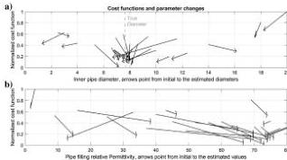
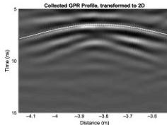

FWI of common-offset GPR using PEST

H37

still misestimates the pipe diameter. After 17 iterations, the model and observed data fit is far superior (Figure 12c).

The inversion process maintains values for pipe-filling material that are close to the expected values for fresh water (see Table 2). The depth and pipe diameter are recovered to within 1% of their known values.

To investigate the sensitivity of the inversion algorithm to the initial values, the FWI process was run 20 times for the water-filled pipe case, similar to the process described above for the synthetic model. Figure 13 summarizes the changes in cost function from the initial value to the final inversion value for the 20 runs, for the pipe inner diameter (Figure 13a) and the pipe-filling relative permittivity (Figure 13b).

Figure 13 illustrates that models with initial pipe diameters between 5 and 10 cm converge to within 1 cm of the 7.6 cm correct value. Models with more widely different starting values end up at local minima of the cost function.

Case study 2: Air-filled pipe

On the same day that the pipe was buried, GPR profiles were collected using the 800 MHz antenna with the same settings as the previous section, but the pipe was empty. An air-filled pipe should produce weaker reflections and a shorter time gap between the upper and lower returns. Presumably, also the sand covering the pipe was less uniformly compacted and drier on the day of burial than six weeks later, and thus we expect more "background noise" and a longer incoming wavelength in this case. These factors combine to make the FWI in this case more challenging, designed to illustrate the efficiency of this technique in a more complex case.

A GPR profile (Figure 14) was selected for the inversion procedure at the same location of the inverted profile in case study 1. Comparing Figures 10 and 14 illustrates the expected effects of water versus air and soil compaction. The air-filled pipe produces less pronounced and overlapping diffraction hyperbolas. There is also some scattered energy recorded before the hyperbolas, as anticipated due to heterogeneity in the sand. Using the ray-based scheme, the average sand relative permittivity was estimated to be 4.52, i.e., an average velocity of almost 0.14 m/ns, indicating that the sand was much dryer at the time of this survey than at the time of the later survey over the water-filled pipe. The depth and the lateral location of the pipe are well-estimated from the ray-based analysis (Table 2). Because there is just one hyperbola recorded from the pipe, the diameter and pipe-filling conductivity estimation are challenging. Traditional hyperbola fitting anticipates the pipes within diameter of 3–30 cm to be a fit to these data. Because the starting model parameters should be provided for FWI, the initial diameter of the pipe is set to 12 cm for the sample run. We can guess that the pipe is filled with air, and the appropriate permittivity and conductivities are assigned.

The 3D to 2D transformation, effective SW estimation (Figure 15), and inversion procedure and assumptions are identical to those described for the water-filled pipe. Similar to two previous cases, the unknowns assigned to the inversion procedure are the

pipe position, pipe diameter, and soil and pipe-filling permittivities. Initial parameter values for a sample run are listed in Table 2, and the inversion results are presented in Figure 16.

The final model after FWI is an improved but clearly imperfect fit to the real data, with the inverted parameter values listed in Table 2. Misfits are presumably caused in part by unmodeled soil heterogeneities. The pipe dimension is recovered with 8% error.

Figure 13. Cost function values associated with the initial guess (tail of arrow) and inversion output (tip of the arrow) for 20 runs. Note that in each run, the initial values of the other variables in the inversion also vary. The thick gray arrows belong to the inversion starting from the ray-based analysis listed in Table 2. (a) The cost function changes with the inner pipe diameter. The dashed gray line marks the known 7.6 cm pipe inner diameter. With starting values of pipe diameter within 50% of the correct value, the inversion improves the estimate of the pipe diameter. (b) The cost function changes with infilling relative permittivity.

Figure 14. The GPR profile over the air-filled pipe, direct wave excluded. A primary reflection from the top of the pipe is observed between 6 and 9 ns. Dewow, zero-time correction, band pass, and average xy filters are applied with the same settings as for the water-filled pipe (Figure 10). Data are transformed to two dimensions. The circles show the arrival-time picks used in the ray-based inversion. The white line shows the arrival-time curves predicted from the ray-based inversion parameters.

Downloaded 01/15/19 to 131.247.224.4. Redistribution subject to SEG license or copyright; see Terms of Use at http://library.seg.org/

47