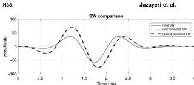
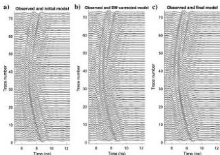
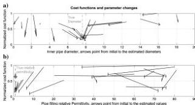

Downloaded 01/15/19 to 131.247.224.4. Redistribution subject to SEG license or copyright; see Terms of Use at http://library.seg.org/

Figure 15. The initial and corrected effective SWs for the air-filled pipe.

Figure 16. (a) Observed data (black) and initial synthetic data (gray) comparison. (b) The same plot after the SW correction. The reflected signals are a better fit. (c) The same plot after the FWI process.

Figure 17. Cost function values associated with the initial guess (tail of the arrow) and the inversion output (tip of arrow) for 20 runs. The thick gray arrows belong to the inversion included in Table 2. (a) The cost function changes with the inner pipe diameter. The dashed gray line marks the known 7.6 cm pipe inner diameter. (b) The cost function changes with the infilling relative permittivity. The dashed gray line marks one as the relative permittivity of air. The inversion process clearly targets local minima if the initial estimate of pipe-filling permittivity is poor.

To investigate the quality of inversion results and assess local minima of the cost function, 20 different models were run with different starting parameters (permittivity of pipe filling and diameter and depth). The SW was estimated for each of the tests separately. Figure 17 summarizes the changes in the cost function from the initial value to the final inversion value for the 20 runs, for the pipe inner diameter (Figure 17a) and the pipe-filling relative permittivity (Figure 17b).

Because of the interference (overlap) in returns between the top of the pipe and the bottom of the pipe in the air-filled case, models that started with initial diameters significantly too large or too small fail to account for the overlap and yield SWs that look dramatically different from those of the better models. This in turn yields unsatisfactory inversion results, underscoring the importance of the initial model. These tests for the air-filled case suggest that the initial models with diameters within 30% of the true diameter are consistently improved in the inversion process.

## DISCUSSION

In these simple field tests, the pipe diameter estimates are significantly improved when the initial guess is within approximately 50% of the true value for the water-filled pipe with distinct returns from the top and bottom, and within approximately 30% of the true value for the air-filled pipe. With the good initial guess, inversion generally proceeds to within 1 cm or less of the true value (in this case to <8% error). This is an improvement over the traditional ray-based scheme, in which the diameter is estimated by trial-and-error fit of the observed hyperbola to the expected arrival times for returns over pipes of varying sizes. As described in the "Introduction" section, the trial-and-error fit for the air-filled pipe case (inner diameter 7.6 cm) yielded reasonable results for diameters ranging from 3 to 30 cm.

This method in its current form is thus suitable for improving good starting estimates of the pipe diameter in simple cases with isolated diffraction hyperbolas. Examination of model runs such as those shown in Tables 1 and 2 and Figure 13 shows that the initially good pipe diameter estimates are also typically slightly improved in the inversion. Conductivity values are fixed to the ray-based analysis results, for the reasons described for previous cases above. To obtain conductivities, the SW could be updated during the FWI following a process similar to Busch et al. (2012, 2014).

The method described here shares the conclusions of Meles et al. (2012) that starting model estimates must be sufficiently good such that

48