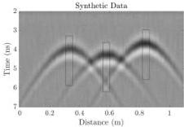

This article has been accepted for inclusion in a future issue of this journal. Content is final as presented, with the exception of pagination.

4

IEEE TRANSACTIONS ON GEOSCIENCE AND REMOTE SENSING

Fig. 1 Synthetic 1-GHz 3-D GPR model of a profile run perpendicular over three cylinders with 1.2-GHz noise and 500-MHz noise. Black boxes contain trace segments used for initial wavelet estimation. Traces are computed for 7 ns; the earliest portions of the traces containing the direct wave arrivals are removed from the analysis.

simplifies to

\[
\mathbf {w} = \underset {\mathbf {w}} {\operatorname{argmin}} \left\| \mathbf {R w} - \mathbf {d} \right\| _ {2} ^ {2} + \lambda_ {\infty} \| \mathbf {w} \| _ {2} ^ {2} \tag {18}
\]

which is an \(\ell_2 - \ell_2\) problem and has a closed-form solution

\[
\mathbf {w} = (\mathbf {R} ^ {T} \mathbf {R} + \lambda_ {\infty} \mathbf {I}) ^ {- 1} \mathbf {R} ^ {T} \mathbf {d} \tag {19}
\]

where I is the identity matrix.

At this point, we stress that the alternating minimization technique is a local minimization approach and special steps must be taken to initialize the unknown variables w and r. The initial estimation of the wavelet is of particular importance and discussed further below.

## II. METHODOLOGY

The proposed SBD method has two stages, the initialization and the main optimization. Our main optimization algorithm is an alternating minimization technique. Because we begin with (17) (updating the reflectivity with wavelet fixed), we require the formulation of an initial wavelet. The main algorithm then solves the general SBD equation (15) or (16) by defining the two subproblems for reflectivity and wavelet expressed in (17) and (18), respectively.

### A. Algorithm Initialization

The proposed algorithm is a local minimizer and, therefore, sensitive to the initial wavelet. For the ground-coupled GPR scenarios considered here, the method is successful when we obtain the initial wavelet from the data. To estimate the initial wavelet, windowed portions of several traces near the apex of the hyperbolic events in the data are averaged, as shown, for example, in the black squared windows in Fig. 1. The windowed traces are first shifted relative to one another to maximize the zero-lag cross correlation. Then, the shifted traces are stacked and normalized to provide the initial wavelet. We note the initial wavelet is estimated in this fashion from the data in both synthetic and real data examples.

### B. Main Optimization

This section describes the alternating minimization technique. First, we illustrate updating the reflectivity series by the alternating split Bregman algorithm for solving (17) and then updating the wavelet by solving (19).

1) Updating Reflectivity With the Alternating Split Bregman Algorithm: Bregman iteration regularization is based on the Bregman distance and solves a constrained optimization problem with a general form of

\[
\mathbf {r} = \underset {\mathbf {r}} {\operatorname{argmin}} \mathcal {C} _ {1} (\mathbf {r}) \quad \text { s.t. } \mathcal {C} _ {2} (\mathbf {r}) = 0 \tag {20}
\]

with  \( C_{1} \)  and  \( C_{2} \)  convex,  \( C_{2} \)  differentiable, and  \( \arg\min_{\mathbf{r}} C_{2}(\mathbf{r}) = 0 \) . The Bregman distance of functional  \( C_{1} \)  between two points  \( r_{1} \)  and  \( r_{2} \)  is defined as

\[
B D _ {\mathcal {C} _ {1}} ^ {\mathrm{R}} \left(\mathbf {r} _ {1}, \mathbf {r} _ {2}\right) = \mathcal {C} _ {1} \left(\mathbf {r} _ {1}\right) - \mathcal {C} _ {1} \left(\mathbf {r} _ {2}\right) - \langle \mathbf {g}, \mathbf {r} _ {1} - \mathbf {r} _ {2} \rangle \tag {21}
\]

where \(\mathbf{g} \in \partial \mathcal{C}_1(\mathbf{r}_2)\) is a subgradient of \(\mathcal{C}_1\) at the \(\mathbf{r}_2\) point. Bregman iterative regularization solves the problem stated in (20) by a sequence of convex problems

\[
\mathbf {r} = \underset {\mathbf {r}} {\operatorname{argmin}} \mathcal {C} _ {1} (\mathbf {r}) - \left\langle \mathbf {g} ^ {k}, \mathbf {r} \right\rangle + \lambda \mathcal {C} _ {2} (\mathbf {r}) \tag {22}
\]

and

\[
\mathbf {g} ^ {k + 1} = \mathbf {g} ^ {k} - \lambda \nabla \mathcal {C} _ {2} (\mathbf {r} ^ {k + 1}) \tag {23}
\]

with \(k = 0,1,2,\ldots\) the iteration number, \(\lambda >0\), \(\nabla\) is the gradient operator, and \(\mathbf{g}^{k + 1}\in \partial \mathcal{C}_1(\mathbf{r}^{k + 1})\). To take advantage of the Bregman iteration, we need to rewrite (17) with a similar format to that in (20)

\[
\left\{\mathbf {r}, \mathbf {t} _ {1} \right\} = \underset {\mathbf {r}, \mathbf {t} _ {1}} {\operatorname{argmin}} \left\| \mathbf {t} _ {1} \right\| _ {2} ^ {2} + \lambda_ {r} \| \mathbf {r} \| _ {1} \text {s.t.} \mathbf {t} _ {1} - (\mathbf {H r} - \mathbf {d}) = 0 \tag {24}
\]

with \(\mathbf{t}_1 = \mathbf{H}\mathbf{r} - \mathbf{d}\). Comparing (24) and (20) reveals that \(\mathcal{C}_1(\mathbf{r},\mathbf{t}_1) = ||\mathbf{t}_1||_2^2 +\lambda_r||\mathbf{r}||_1\) and \(\mathcal{C}_2(\mathbf{r},\mathbf{t}_1) = \mathbf{t}_1 - (\mathbf{H}\mathbf{r} - \mathbf{d})\). Using the new \(\mathcal{C}_1\) and \(\mathcal{C}_2\) functionals and defining \(\mathbf{t}_2 = \mathbf{r}\), we derive the simplified Bregman iterations (for detailed derivations see [39]) as

\[
\begin{array}{l} \left\{\mathbf {r} ^ {k + 1}, \mathbf {t} _ {1} ^ {k + 1}, \mathbf {t} _ {2} ^ {k + 1} \right\} = \underset {\mathbf {r}, \mathbf {t} _ {1}, \mathbf {t} _ {2}} {\operatorname{argmin}} \| \mathbf {t} _ {1} \| _ {2} ^ {2} + \lambda_ {r} \| \mathbf {t} _ {2} \| _ {1} \\ + \frac {\alpha}{2} \mathbf {t} _ {1} - (\mathbf {H r} - \mathbf {y}) - \mathbf {g} _ {1} ^ {k} \\ + \frac {\beta}{2} \mathbf {t} _ {2} - \mathbf {r} - \mathbf {g} _ {2} ^ {k} \begin{array}{c c} 2 & \\ 2 & \end{array} \tag {25} \\ \end{array}
\]

\[
\mathbf {g} _ {1} ^ {k + 1} = \mathbf {g} _ {1} ^ {k} - \mathbf {t} _ {1} ^ {k + 1} - (\mathbf {H r} ^ {k + 1} - \mathbf {y}) \tag {26}
\]

\[
\mathbf {g} _ {2} ^ {k + 1} = \mathbf {g} _ {2} ^ {k} - \mathbf {t} _ {2} ^ {k + 1} - \mathbf {r} ^ {k + 1} \tag {27}
\]

with \(\mathbf{g}_1^0 = \mathbf{g}_2^0 = \mathbf{0}\) and \(\alpha, \beta > 0\). The final step is to solve (25). Goldstein and Osher [39] show that (25) can be divided into three sub-problems where

\[
\mathbf {r} ^ {k + 1} = \underset {\mathbf {r}} {\operatorname{argmin}} \frac {\alpha}{2} \mathbf {t} _ {1} ^ {k} - (\mathbf {H r} - \mathbf {y}) - \mathbf {g} _ {1} ^ {k} + \frac {\beta}{2} \mathbf {t} _ {2} ^ {k} - \mathbf {r} - \mathbf {g} _ {2} ^ {k} \tag {28}
\]

\[
\mathbf {t} _ {1} ^ {k + 1} = \underset {\mathbf {d}} {\operatorname{argmin}} \frac {\alpha}{2} \| \mathbf {d} - (\mathbf {H r} ^ {k + 1} - \mathbf {y}) - \mathbf {g} _ {1} ^ {k} \| + \| \mathbf {d} \| _ {2} ^ {2} \tag {29}
\]

\[
\mathbf {t} _ {2} ^ {k + 1} = \underset {\mathbf {d}} {\operatorname{argmin}} \frac {\beta}{2} \mathbf {d} - \mathbf {H r} ^ {k + 1} - \mathbf {g} _ {2} ^ {k} + \lambda_ {r} \| \mathbf {d} \| _ {1}. \tag {30}
\]

59