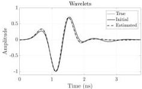
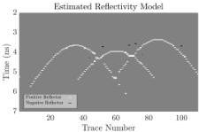

This article has been accepted for inclusion in a future issue of this journal. Content is final as presented, with the exception of pagination.

6

IEEE TRANSACTIONS ON GEOSCIENCE AND REMOTE SENSING

parameter for wavelet update $\lambda_w$. The length of the wavelet, $L$, is defined subjectively as a full wavelength, which may include a “tail” over which the pulse amplitudes converge to zero (examples are shown in results below).

The choice of regularization parameter $\lambda_r$ has a significant impact on the estimated reflectivities. If the noise level $\delta$ is known, Pareto curves can be used to define $\lambda_r$ [40], [41]. Alternatively, the minimizer of the generalized cross-validation (GCV) score [42] can be used for selecting the regularization parameter

$$\mathrm{GCV}(\lambda_r) = \frac{\|\mathbf{H} \mathbf{r}_{\lambda_r} - \mathbf{d}\|_2^2}{(N - C \times \|\mathbf{r}_{\lambda_r}\|_0)^2} \tag{35}$$

where $\|\cdot\|_0$ is an $\ell_0$ norm that counts the number of nonzero elements, $C$ is an stabilizing parameter [43], and $\mathbf{r}_{\lambda_r}$ is the solution of (17) to a specific regularization parameter $\lambda_r$. A range of different parameters are tested and the minimizer of the GCV score is selected as the optimum $\lambda_r$. The GCV score method has the advantage of not requiring any prior information about the noise level so is used for real-data cases. Our tests on synthetic data show that the $\lambda_r$ values estimated from the Pareto curve and the GCV score are similar.

For the wavelet update, we need to define the optimum $\lambda_w$ parameter. Again, we make use of GCV score. The score for the Wiener deconvolution formulation of the wavelet estimation [2], [44] is defined as

$$\mathrm{GCV}(\lambda_w) = \frac{\|\mathbf{R} \mathbf{w}_{\lambda_w} - \mathbf{d}\|_2^2}{\left(N - C \times \sum_{k=0}^{N-1} \frac{(c_k k)^2}{(\lambda_k k)^2 + \lambda_w}\right)^2} \tag{36}$$

where $\mathbf{w}_{\lambda_w}$ is the solution of (18) to a specific regularization parameter $\lambda_w$. The $\alpha, \beta > 0$ are the split Bregman tradeoff parameters. We find that the recommended values of $\alpha = 0.5$, $\beta = 1$ from Gholami and Sacchi [2] work well for GPR data with Gaussian noise. High values make the numerical problem unstable. Our tests show that in data sets with high-amplitude low-frequency noise (typical for some GPR data) $\alpha = 0.001 - 0.01$, $\beta = 1$ produce optimal reflectivity and wavelet models.

### IV. NUMERICAL RESULTS

Synthetic data sets with two different noise levels and a field data set incorporating cylindrical objects (pipes and tree roots) buried in soil are considered for performance evaluation of the proposed method.

#### A. Synthetic Data, Cylindrical Objects Model, and Low Noise Level

The first model uses a mixed-phase GPR wavelet with 1-GHz (Hertzian dipole antenna with a transmitter-receiver offset of 3 cm) system response over three cylinders with different sizes and depths embedded in a homogeneous soil (see Table I for details). Cylinders have higher velocities than the background soil. Synthetic data are created with the software package gprMax [45] in 3-D. Noise is added to the modeled data, with a Gaussian distribution of high-frequency noise centered at 1.2 GHz and the peak value of 15% of the pulse amplitude, and lower frequency noise (500 MHz) added

TABLE I
OBJECT AND SOIL CHARACTERISTICS FOR SYNTHETIC DATA SHOWN IN
FIG. 1. INFORMATION ABOUT THE ANTENNA AND SPLIT BRIEGMAN PARAMETERS IS INCLUDED IN THE BOTTOM HALF

|  Object | Depth (cm) | Diameter (cm) | Relative Permittivity  |
| --- | --- | --- | --- |
|  Left | 19 | 2 | 7  |
|  Middle | 21 | 6 | 8  |
|  Right | 17 | 4 | 10  |
|  Soil |  |  | 5  |
|  Antenna Frequency (GHz) | Time Window (ns) | $\alpha$ | $\beta$  |
|  1 | 7 | 0.5 for case 1 and 0.001 for case 2 | 1 for case 1 and 0.5 for case 2  |

Fig. 2. Results from the deconvolution of the synthetic data shown in Fig. 1. (Top) True synthetic, initial, and final estimated wavelets. The graph shows the full length (3.7 ns) of the assumed wavelet. (Bottom) Estimated reflectivity model.

at a lower level (10% of pulse amplitude) (Fig. 1). To avoid the complexity of the direct wave, we applied a background removal filter to mute the direct wave. To estimate the initial wavelet, five traces around the apex of each hyperbolic event (seen in black boxes in Fig. 1) are selected, time-shifted to maximize zero-lag cross correlation, stacked and finally normalized [Fig. 2 (top)].

After seven iterations of the main loop of the algorithm, the model converges to the desired minimum, resulting in a final wavelet [red dashed line in Fig. 2 (top)] very close to the true wavelet [black line in Fig. 2 (top)] and a favorable sparse estimate of the reflectivity model [Fig. 2 (bottom)].

61