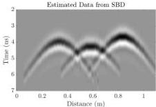
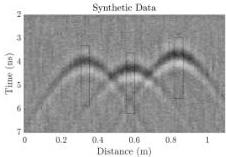
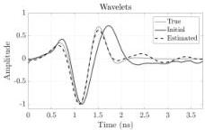
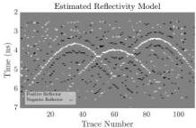

This article has been accepted for inclusion in a future issue of this journal. Content is final as presented, with the exception of pagination.

JAZAYERI et al.: SBD OF GPR DATA

7

Fig. 3. Estimated data from SBD for the cylinders model with high-frequency noise and moderate low-frequency noise. Comparison with Fig. 1 shows the noise is reduced.

Fig. 4. Synthetic 1-GHz 3-D GPR model over buried cylinders as given in Fig. 1, but with higher levels of low-frequency noise. Black boxes indicate trace segments used for initial wavelet estimation. Early direct wave arrivals are removed before analysis.

The polarity, location, and shape of the hyperbolic returns from the cylinders are extremely well recovered. The low-frequency random noise triggers very few sparse isolated reflectors. The data estimated from the convolution product of the final wavelet and the reflectivity model are shown in Fig. 3. Comparing this result with the original data in Fig. 1 shows the proposed SBD algorithm is an efficient method for reducing the level of high-frequency noise. It should also be noted that a higher resolution image of the estimated reflectivity models is obtained after SBD compared to the collected data as the impact of the transmitted pulse is erased from the data. The estimated reflectivity model is an ideal model that can be used in traditional curve fitting to identify the geometry and location of the reflecting objects.

### B. Synthetic Data, Cylindrical Objects Model, and High Noise Level

To create a somewhat more realistic case, a higher level of low-frequency noise (30% of pulse amplitude with 100–600-MHz frequency range) is added to the previously described model (Fig. 4). Such low-frequency noise, typical of many GPR data sets, is much more challenging to remove than high-frequency noise. We find that with the selection of

Fig. 5. Results from the deconvolution of the noisier synthetic data shown in Fig. 4. (Top) True, initial, and final estimated wavelets using the same split Bregman parameters $\alpha = 0.5$ and $\beta = 1$, which were used in the lower noise case in Fig. 2. (Bottom) Estimated reflectivity model of the cylinders. Random spikes caused by the low-frequency noise could make it challenging to identify the hyperbolic reflector.

$\alpha = 0.5$ and $\beta = 1$, the SBD fails to remove much of the noise and the reconstructed reflectivity model clearly suffers (Fig. 5). Here, the location and the shape of the hyperbolic reflectors are well recovered, but the reflectivity model could be difficult to interpret against the background noise. The estimated wavelet also suffers from the noise, especially at the tail of the pulse, where the amplitude fails to converge rapidly to zero (orange dashed pulse in Fig. 5).

To do a better job at reducing the low-frequency noise, a range of the split Bregman tradeoff parameters were tested. We find that for GPR data with high levels of low-frequency noise, $\alpha = 0.01$ to 0.001 and $\beta = 0.5$ are more successful in noise reduction and optimal reflectivity and wavelet recovery. Fig. 6 is obtained with $\alpha = 0.001$ and $\beta = 0.5$ ($\alpha = 0.01$ produces almost the same results). Comparison of Figs. 5 and 6 clearly illustrates the importance of the selection of the split Bregman tradeoff parameters. The shape of the estimated wavelet in both cases is generally similar, but the estimated source wavelet in Fig. 6 is much closer to the true wavelet, especially in the tail. Some sparse random reflectors remain in the model, presumably due to the similarity between the noise and the pulse frequencies at those locations.

### C. Real Data

A Mala ProEX system with an 800-MHz shielded antenna pair was used to gather a common-offset profile over an 8-cm-diameter metallic pipe buried in the sand (at distance

62