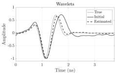
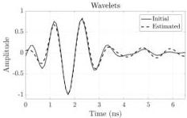
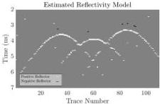
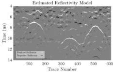
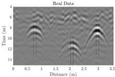

This article has been accepted for inclusion in a future issue of this journal. Content is final as presented, with the exception of pagination.

8

IEEE TRANSACTIONS ON GEOSCIENCE AND REMOTE SENSING

Fig. 6. (Top) True, initial, and estimated wavelets as given in Fig. 5, but with split Bregman tradeoff parameters $\alpha = 0.001$ and $\beta = 0.5$. (Bottom) Estimated reflectivity model of the cylinders is much less noisy, compared to Fig. 5.

Fig. 8. (Top) Initial and final estimated wavelets for the data set shown in Fig. 7 with $\alpha = 0.5$ and $\beta = 1$. (Bottom) Corresponding estimated reflectivity model. The reflectivity image contains more complexity than desired.

Fig. 7. GPR transect over a metallic pipe (0.75 m along profile) and tree roots (2.1 and 3.0 m) in sand. A low-pass (2 GHz) filter has been applied to reduce high-frequency noise. The direct wave arrival has been cropped from the top of the time axis. No gains are applied. Black boxes contain trace segments used in the initial wavelet calculation.

approximately 0.75 m along the GPR profile shown in Fig. 7). Two other distinctive hyperbolic patterns are seen in the data; these are created by tree roots. High-frequency noise is removed from the data by a simple low-pass filter removing frequencies greater than 2 GHz. Soil heterogeneities generate additional radar returns, especially visible around 6-ns two-way travel time.

Similar to the synthetic models, a background removal is applied and the computation of the initial wavelet does not

use the direct wave (before 4 ns, not shown). This is because the direct wave varies along the transect due to variations in soil moisture, surface roughness, and antenna-ground coupling (Fig. 7). This first arrival also falls in the near field of the antenna, and compensation for near-field effects is beyond the scope of this paper (in such settings, it would likely be more effective to estimate the optimum wavelet and reflectivities for each individual transmitter location separately, rather than estimating one best-fit wavelet for the whole data set, a topic also beyond the scope of this paper).

The initial wavelet is calculated by time shifting, stacking, and finally normalizing a few traces around the apex of each hyperbolic event shown in boxes in Fig. 7 (similar to the synthetic case). As for the “noisier” synthetic case, selection of the split Bregman parameters strongly influences results. Comparing Figs. 8 and 9, setting $\alpha = 0.001$ and $\beta = 0.5$ reduces the number of estimated reflectors ($\alpha = 0.01$ provided almost the same reflectivity and wavelet model as $\alpha = 0.001$.) In this latter case (Fig. 9), the hyperbolic shapes of the pipe and roots reflectors are recovered well with fewer reflectors placed earlier than 6 ns and later than the hyperbola arrivals. We stress that in this particular case, recovering the reflectivity model of cylindrical objects was the desired target, rather than soil heterogeneity. The overall shape of the source wavelet recovered with both parameter selections is similar (Figs. 8 and 9), but the latter model yields fewer noncylindrical target reflectors. We find that limiting the source wavelet length to just

63