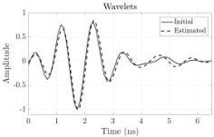
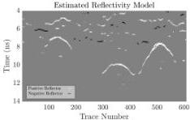
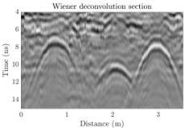

This article has been accepted for inclusion in a future issue of this journal. Content is final as presented, with the exception of pagination.

JAZAYERI et al.: SBD OF GPR DATA

9

Fig. 9. (Top) Initial and final estimated wavelets for the data set shown in Fig. 7 with α = 0.001 and β = 0.5 (α = 0.01 provides very similar models). (Bottom) Corresponding estimated reflectivity model. The additional peak in the early part of the wavelet allows parts of the complexity in the data to be shifted from the reflectivity series to the wavelet.

Fig. 10. Wiener deconvolution reflectivity series for the real data in Fig. 7. The signature of the source wavelet is reduced but the reflectivity series still shows the residual wavelet, i.e., the difference between the actual wavelet and its minimum phase equivalent.

the main cycle (i.e., <4 ns length) generates an undesirable train of hyperbolas in the estimated reflectivity model.

Finally, we compare the performance of the SBD algorithm (Fig. 9) with Wiener deconvolution (Fig. 10). Wiener deconvolution assumes that the wavelet has minimum phase and that the reflectivity series is white noise. These assumptions are not satisfied in real-world GPR data, and as a result, the Wiener deconvolution is less effective at removing the effect of the

wavelet from the data. Although the recovered reflectivity series (Fig. 10) shows more focused events than the original data (Fig. 7), the series is smooth and lacks the high-resolution features present in the SBD reflectivity series (Fig. 9).

## V. CONCLUSION

The proposed SBD method is tested on synthetic and simple field GPR data. The method estimates the reflectivity model of the subsurface and the transmitted pulse shape efficiently and simultaneously without requiring any prior information from the subsurface or any assumption about the phase of the wavelet. The initial source wavelet estimate is made by extracting and averaging a subset of the data. The process then iteratively updates the reflectivity model and source wavelet. The method is tested on data sets with cylindrical targets and different noise levels. High-frequency noise alone is handled with the split Bregman algorithm parameters α = 0.5 and β = 1, while scenarios with more low-frequency noise and a complex pulse are better treated with α = 0.01 to 0.001 and β = 0.5. The hyperbolic shapes of the recorded signals are well recovered in the reflectivity models. In the synthetic models, the initial wavelet estimate is improved upon, and the final wavelet estimate is a good fit to the true wavelet.

For GPR studies, SBD can be useful for image resolution enhancement and better understanding of the source wavelet. Both the estimated source wavelet and reflectivity model can be used in further advanced modeling procedures such as FWI. Compensation for near-field signal propagation effects is a subject of future research.

## ACKNOWLEDGMENT

The authors would like to thank S. Esmaeili for assistance in making plots, and A. Ebrahimi for guidance and constructive discussions. They would also like to thank three anonymous reviewers and the associate editor who gave constructive reviews that greatly improved this paper.

## REFERENCES

[1] F. Sroubek and P. Milanfar, "Robust multichannel blind deconvolution via fast alternating minimization," IEEE Trans. Image Process., vol. 21, no. 4, pp. 1687-1700, Apr. 2012.

[2] A. Gholami and M. D. Sacchi, "A fast and automatic sparse deconvolution in the presence of outliers," IEEE Trans. Geosci. Remote Sens., vol. 50, no. 10, pp. 4105-4116, Oct. 2012.

[3] G. P. Angeleri, "A statistical approach to the extraction of the seismic propagating wavelet," Geophys. Prospecting, vol. 31, no. 5, pp. 726-747, 1983.

[4] R. E. Sheriff and L. P. Geldart, Exploration Seismology. Cambridge, U.K.: Cambridge Univ. Press, 1995.

[5] J. Xia, E. K. Franssen, R. D. Miller, T. V. Weis, and A. P. Byrnes, "Improving ground-penetrating radar data in sedimentary rocks using deterministic deconvolution," J. Appl. Geophys., vol. 54, nos. 1-2, pp. 15-33, 2003.

[6] N. Economou, A. Validis, H. Hamdan, G. Kritikakis, N. Andronikidis, and K. Dimitriadis, "Time-varying deconvolution of GPR data in civil engineering," Nondestruct. Test Eval., vol. 27, no. 3, pp. 285-292, 2012.

[7] N. Economou and A. Validis, "GPR data time varying deconvolution by kurtosis maximization," J. Appl. Geophys., vol. 81, pp. 117-121, Jun. 2012.

[8] I. Abdel-Qader, V. Krause, F. Abu-Amara, and O. Abudayyeh, "Comparative study of deconvolution algorithms for GPR bridge deck imaging," WSEAS Trans. Signal Process., vol. 10, no. 1, pp. 9-20, 2014.

64