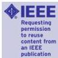

Rightslink® by Copyright Clearance Center

1/10/19, 1:39 PM

RightsLink®

**Title:** Sparse Blind Deconvolution of Ground Penetrating Radar Data
**Author:** Sajad Jazayeri
**Publication:** Geoscience and Remote Sensing, IEEE Transactions on
**Publisher:** IEEE
**Date:** Dec 31, 1969
Copyright © 1969, IEEE

Logged in as:
Sajad Jazayeri
Account #:
3001390487

LOGOUT

### Thesis / Dissertation Reuse

**The IEEE does not require individuals working on a thesis to obtain a formal reuse license, however, you may print out this statement to be used as a permission grant:**

*Requirements to be followed when using any portion (e.g., figure, graph, table, or textual material) of an IEEE copyrighted paper in a thesis:*

1) In the case of textual material (e.g., using short quotes or referring to the work within these papers) users must give full credit to the original source (author, paper, publication) followed by the IEEE copyright line © 2011 IEEE.
2) In the case of illustrations or tabular material, we require that the copyright line © [Year of original publication] IEEE appear prominently with each reprinted figure and/or table.
3) If a substantial portion of the original paper is to be used, and if you are not the senior author, also obtain the senior author's approval.

*Requirements to be followed when using an entire IEEE copyrighted paper in a thesis:*

1) The following IEEE copyright/ credit notice should be placed prominently in the references: © [year of original publication] IEEE. Reprinted, with permission, from [author names, paper title, IEEE publication title, and month/year of publication]
2) Only the accepted version of an IEEE copyrighted paper can be used when posting the paper or your thesis on-line.
3) In placing the thesis on the author's university website, please display the following message in a prominent place on the website: In reference to IEEE copyrighted material which is used with permission in this thesis, the IEEE does not endorse any of [university/educational entity's name goes here]'s products or services. Internal or personal use of this material is permitted. If interested in reprinting/republishing IEEE copyrighted material for advertising or promotional purposes or for creating new collective works for resale or redistribution, please go to http://www.ieee.org/publications_standards/publications/rights/rights_link.html to learn how to obtain a License from RightsLink.

If applicable, University Microfilms and/or ProQuest Library, or the Archives of Canada may supply single copies of the dissertation.

BACK

CLOSE WINDOW

Copyright © 2019 Copyright Clearance Center, Inc. All Rights Reserved. Privacy statement, Terms and Conditions. Comments? We would like to hear from you. E-mail us at customercare@copyright.com

https://s100.copyright.com/AppDispatchServlet#formTop

Page 1 of 2

67