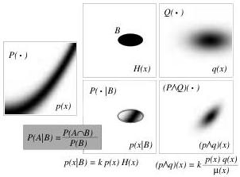

Figure 1: The two left columns of the figure illustrate the definition of conditional probability (see text for details). The right of the figure explains that the definition of the AND operation is a generalization of the notion of conditional probability. While a conditional probability combines a probability distribution \( P(\cdot) \) with an 'event' \( \mathcal{B} \), the AND operation combines two probability distributions \( P(\cdot) \) and \( Q(\cdot) \) defined over the same space. See text for a detailed explanation.

We emphasize here the following:

Example 2 is at the basis of the paradigm that we use below to solve inverse problems.

More generally, the conjunction of the probability densities  \( f_{1}(\mathbf{x}) \) ,  \( f_{2}(\mathbf{x}) \)  ... is

\[
h (\mathbf {x}) = \left(f _ {1} \wedge f _ {2} \wedge f _ {3} \dots\right) (\mathbf {x}) \dots = k \mu (\mathbf {x}) \frac {f _ {1} (\mathbf {x})}{\mu (\mathbf {x})} \frac {f _ {2} (\mathbf {x})}{\mu (\mathbf {x})} \frac {f _ {3} (\mathbf {x})}{\mu (\mathbf {x})} \dots . \tag {15}
\]

For a formalization of the notion of conjunction of probabilities, the reader is invited to read appendix G.

### 2.4 Conditional Probability Density

Given a probability distribution over a space \(\mathcal{X}\), represented by the probability density \(f(\mathbf{x})\), and given a subspace \(\mathcal{B}\) of \(\mathcal{X}\) of lower dimension, can we, in a consistent way, infer a probability distribution over \(\mathcal{B}\), represented by a probability density \(f(\mathbf{x}|\mathcal{B})\) (to be named the conditional probability density 'given \(\mathcal{B}'\))?

The answer is: using only the elements given, NO, THIS IS NOT POSSIBLE.

The usual way to induce a probability distribution on a subspace of lower dimension is to assign a 'thickness' to the subspace \(\mathcal{B}\), to apply the general definition of conditional probability (this time to a region of \(\mathcal{X}\), not to a subspace of it) and to take the limit when the 'thickness' tends to zero. But, as suggested in figure 2, there are infinitely many ways to take this limit, each defining a different 'conditional probability density' on \(\mathcal{B}\). Among the infinitely many ways to define a conditional probability density there is one that is based on the notion of distance between points in the space, and therefore corresponds to an intrinsic definition (see figure 2).

Assume that the space \(\mathcal{U}\) has \(p\) dimensions, the space \(\mathcal{V}\) has \(q\) dimensions and define in the \((p + q)\)-dimensional space \(\mathcal{X} = (\mathcal{U},\mathcal{V})\) a \(p\)-dimensional subspace by the \(p\) relations

\[
v _ {1} = v _ {1} (u _ {1}, u _ {2}, \dots , u _ {p})
\]

\[
v _ {2} = v _ {2} (u _ {1}, u _ {2}, \dots , u _ {p})
\]

\[
\dots = \dots
\]

\[
v _ {q} = v _ {q} \left(u _ {1}, u _ {2}, \dots , u _ {p}\right). \tag {16}
\]

The restriction of a probability distribution, represented by the probability density \( f(\mathbf{x}) = f(\mathbf{u},\mathbf{v}) \) into the subspace defined by the constraint \( \mathbf{v} = \mathbf{v}(\mathbf{u}) \), can be defined with all generality when it is assumed that we have a metric defined over the \( (p + q) \)-dimensional space \( \mathcal{X} = (\mathcal{U},\mathcal{V}) \). Let us limit here to the special circumstance (useful for a vast majority of inverse problems\(^9\)) where there the \( (p + q) \)-dimensional space \( \mathcal{X} \) is built as the Cartesian product of \( \mathcal{U} \) and \( \mathcal{V} \) (then we write, as usual, \( \mathcal{X} = \mathcal{U} \times \mathcal{V} \)). In this case, there is a metric \( \mathbf{g}_u \) over \( \mathcal{U} \), with associated volume element \( dV_u(\mathbf{u}) = \sqrt{\det\mathbf{g}_u} d\mathbf{u} \), there is a metric \( \mathbf{g}_v \) over \( \mathcal{V} \), with associated volume element \( dV_v(\mathbf{v}) = \sqrt{\det\mathbf{g}_v} d\mathbf{v} \), and the global volume element is simply \( dV(\mathbf{u},\mathbf{v}) = dV_u(\mathbf{u}) dV_v(\mathbf{v}) \).

The restriction of the probability distribution represented by the probability density \( f(\mathbf{u},\mathbf{v}) \) on the subspace \( \mathbf{v} = \mathbf{v}(\mathbf{u}) \) (i.e., the conditional probability density given \( \mathbf{v} = \mathbf{v}(\mathbf{u}) \)) is a probability distribution on the submanifold

\( ^{9} \) As a counter example, working at the surface of the sphere with geographical coordinates  \( (\mathbf{u},\mathbf{v})=(u,v)=(\vartheta,\varphi) \)  this condition is not fulfilled, as  \( g_{\varphi}=\sin\theta \)  is a function of  \( \vartheta \) : the surface of the sphere is not the Cartesian product of two 1D spaces.

11