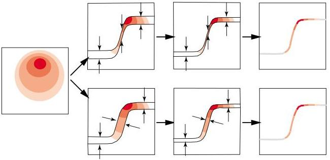

Figure 2: An original 2D probability density, and two possible ways (among many) of defining a region of the space whose limit is a given curve. At the top is the 'vertical' limit, while at the bottom is the normal (or orthogonal) limit. Each possible limit defines a different 'induced' or 'conditional' probability density. Only the orthogonal limit gives an intrinsic definition (i.e., a definition invariant under any change of variables). It is, therefore, the only one examined in this work.

\(\mathbf{v} = \mathbf{v}(\mathbf{u})\). We could choose ad-hoc coordinates over this manifold, but as there is a one-to-one correspondence between the coordinates \(\mathbf{u}\) and the points on the manifold, the conditional probability density can be expressed using the coordinates \(\mathbf{u}\). The restriction of \(f(\mathbf{u},\mathbf{v})\) over the submanifold \(\mathbf{v} = \mathbf{v}(\mathbf{u})\) defines the probability density (see appendix B for the more general case)

\[
f _ {u | v (u)} (\mathbf {u} | \mathbf {v} = \mathbf {v} (\mathbf {u})) = k f (\mathbf {u}, \mathbf {v} (\mathbf {u})) \left. \frac {\sqrt {\det \left(\mathbf {g} _ {u} + \mathbf {V} ^ {T} \mathbf {g} _ {v} \mathbf {V}\right)}}{\sqrt {\det \mathbf {g} _ {u}} \sqrt {\det \mathbf {g} _ {v}}} \right| _ {\mathbf {v} = \mathbf {v} (\mathbf {u})}, \tag {17}
\]

where \( k \) is a normalizing constant, and where \( \mathbf{V} = \mathbf{V}(\mathbf{u}) \) is the matrix of partial derivatives (see appendix K for a simple explicit calculation of such partial derivatives)

\[
\left( \begin{array}{c c c c} V _ {1 1} & V _ {1 2} & \dots & V _ {1 p} \\ V _ {2 1} & V _ {2 2} & \dots & V _ {2 p} \\ \vdots & \vdots & \ddots & \vdots \\ V _ {q 1} & V _ {q 2} & \dots & V _ {q p} \end{array} \right) = \left( \begin{array}{c c c c} \frac {\partial v _ {1}}{\partial u _ {1}} & \frac {\partial v _ {1}}{\partial u _ {2}} & \dots & \frac {\partial v _ {1}}{\partial u _ {p}} \\ \frac {\partial v _ {2}}{\partial u _ {1}} & \frac {\partial v _ {2}}{\partial u _ {2}} & \dots & \frac {\partial v _ {2}}{\partial u _ {p}} \\ \vdots & \vdots & \ddots & \vdots \\ \frac {\partial v _ {q}}{\partial u _ {1}} & \frac {\partial v _ {q}}{\partial u _ {2}} & \dots & \frac {\partial v _ {q}}{\partial u _ {p}} \end{array} \right). \tag {18}
\]

Example 3 If the hypersurface \(\mathbf{v} = \mathbf{v}(\mathbf{u})\) is defined by a constant value of \(\mathbf{v}\), say \(\mathbf{v} = \mathbf{v}_0\), then equation 17 reduces to

\[
f _ {u | v} (\mathbf {u} | \mathbf {v} = \mathbf {v} _ {0}) = k f (\mathbf {u}, \mathbf {v} _ {0}) = \frac {f (\mathbf {u} , \mathbf {v} _ {0})}{\int_ {\mathcal {U}} d \mathbf {u} f (\mathbf {u} , \mathbf {v} _ {0})}. \tag {19}
\]

[END OF EXAMPLE.]

Elementary definitions of conditional probability density are not based on this notion of distance-based uniform convergence, but use other, ill-defined limits. This is a mistake that, unfortunately, pollutes many scientific works. See appendix P, in particular, for a discussion on the “Borel paradox”.

Equation 17 defines the conditional \( f_{u|v(u)}(\mathbf{u}|\mathbf{v} = \mathbf{v}(\mathbf{u})) \). Should the relation \( \mathbf{v} = \mathbf{v}(\mathbf{u}) \) be invertible, it would correspond to a change of variables. It is then possible to show that the alternative conditional \( f_{v|u(v)}(\mathbf{v}|\mathbf{u} = \mathbf{u}(\mathbf{v})) \), is related to \( f_{u|v(u)}(\mathbf{u}|\mathbf{v} = \mathbf{v}(\mathbf{u})) \) through the Jacobian rule. This is a property that elementary definitions of conditional probability do not share.

12