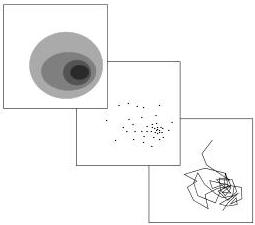

Monte Carlo method about to be described). It is clear that if we make a histogram with these points, in the limit of a sufficiently large number of points we recover the representation at the left. Disregarding the histogram possibility we can concentrate on the individual points. In the 2D example of the figure we have actual points in a plane. If the problem is multi-dimensional, each 'point' may correspond to some abstract notion. For instance, for a geophysicist a 'point' may be a given model of the Earth. This model may be represented in some way, for instance a by color plot. Then a collection of 'points' is a collection of such pictures. Our experience shows that, given a collection of randomly generated 'models', the human eye-brain system is extremely good at apprehending the basic characteristics of the underlying probability distribution, including possible multimodalities, correlations, etc.

Figure 3: An explicit representation of a 2D probability distribution and the sampling of it, using Monte Carlo methods. While the representation at the top-left cannot be generalized to high dimensions, the examination of a collection of points can be done in arbitrary dimensions. Practically, Monte Carlo generation of points is done through a 'random walk' where a 'new point' is generated in the vicinity of the previous point.

When such a (hopefully large) collection of random models is available we can also answer quite interesting questions. For instance, a geologist may ask: at which depth is that subsurface structure? To answer this, we can make an histogram of the depth of the given geological structure over the collection of random models, and the histogram is the answer to the question. What is the probability of having a low velocity zone around a given depth? The ratio of the number of models presenting such a low velocity zone over the total number of models in the collection gives the answer (if the collection of models is large enough).

This is essentially what we propose: looking at a large number of randomly generated models in order to intuitively apprehend the basic properties of the probability distribution, followed by calculation of the probabilities of all interesting 'events'.

Practically, as we shall see, the random sampling is not made by generating points independently of each other. Rather, as suggested in the last image of figure 3, through a 'random walk' where a 'new point' is generated in the vicinity of the previous point.

Monte Carlo methods have a random generator at their core. At present, Monte Carlo methods are typically implemented on digital computers, and are based on pseudorandom generation of numbers¹⁰. As we shall see, any conceivable operation on probability densities (e.g., computing marginals and conditionals, integration, conjunction (the AND operation), etc.) has its counterpart in an operation on/by their corresponding Monte Carlo algorithms.

Inverse problems are often formulated in high-dimensional spaces. In this case a certain class of Monte Carlo algorithms, the so-called importance sampling algorithms, come to the rescue, allowing us to sample the space with a sampling density proportional to the given probability density. In this case excessive (and useless) sampling of low-probability areas of the space is avoided. This is not only important, but in fact vital in high dimensional spaces.

Another advantage of the importance sampling Monte Carlo algorithms is that we need not have a closed form mathematical expression for the probability density we want to sample. Only an algorithm that allows us to evaluate it at a given point in the space is needed. This has considerable practical advantage in analysis of inverse problems where computer intensive evaluation of, e.g., misfit functions plays an important role in calculation of certain probability densities.

Given a probability density that we wish to sample, and a class of Monte Carlo algorithms that samples this density, which one of the algorithms should we choose? Practically, the problem is here to find the most efficient of these algorithms. This is an interesting and difficult problem that we will not go into detail with here. We

¹⁰I.e., series of numbers that appear random if tested with any reasonable statistical test.

14