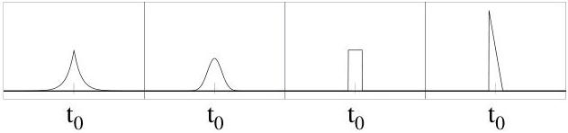

## 4.2 Prior Information on Model Parameters

In a typical geophysical problem, the model parameters contain geometrical parameters (positions and sizes of geological bodies) and physical parameters (values of the mass density, of the elastic parameters, the temperature, the porosity, etc.).

The prior information on these parameters is all the information we possess independently of the particular measurements that will be considered as 'data' (to be described below). This prior probability distribution is generally quite complex, as the model space may be high-dimensional, and the parameters may have nonstandard probability densities.

To this generally complex probability distribution over the model space corresponds a probability density that we denote $\rho_{\mathcal{M}}(\mathbf{m})$.

If an explicit expression for the probability density $\rho_{\mathcal{M}}(\mathbf{m})$ is known, it can be used in analytical developments. But such an explicit expression is, by no means, necessary. Using Monte Carlo methods, all that is needed is a set of probabilistic rules that allows us to generate samples distributed according to $\rho_{\mathcal{M}}(\mathbf{m})$ in the model space (Mosegaard and Tarantola, 1995).

Example 4 Appendix E presents an example of prior information for the case of an Earth model consisting of a stack of horizontal layers with variable thickness and uniform mass density. [END OF EXAMPLE.]

## 4.3 Measurements and Experimental Uncertainties

Observation of geophysical phenomena is represented by a set of parameters d that we usually call data. These parameters result from prior measurement operations, and they are typically seismic vibrations on the instrument site, arrival times of seismic phases, gravity or electromagnetic fields. As in any measurement, the data is determined with an associated uncertainty, described by a probability density over the data parameter space, that we denote here $\rho_{\mathcal{D}}(\mathbf{d})$. This density describes, not only marginals on individual datum values, but also possible cross-relations in data uncertainties.

Although the instrumental errors are an important source of data uncertainties, in geophysical measurements there are other sources of uncertainty. The errors associated with the positioning of the instruments, the environmental noise, and the human factor (like for picking arrival times) are also relevant sources of uncertainty.

Figure 4: What has an experimenter in mind when she/he describes the result of a measurement by something like $t = t_0 \pm \sigma$?

18