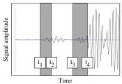
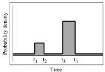

### Example 5 Non-analytic Probability Density

Assume that we wish to measure the time t of occurrence of some physical event. It is often assumed that the result of a measurement corresponds to something like

\[
t = t _ {0} \pm \sigma . \tag {34}
\]

An obvious question is the exact meaning of the  \( \pm\sigma \) . Has the experimenter in mind that she/he is absolutely certain that the actual arrival time satisfies the strict conditions  \( t_{0}-\sigma\leq t\leq t_{0}+\sigma \) , or has she/he in mind something like a Gaussian probability, or some other probability distribution (see figure 4)? We accept, following ISO's recommendations (1993) that the result of any measurement has a probabilistic interpretation, with some sources of uncertainty being analyzed using statistical methods ('type A' uncertainties), and other sources of uncertainty being evaluated by other means (for instance, using Bayesian arguments) ('type B' uncertainties). But, contrary to ISO suggestions, we do not assume that the Gaussian model of uncertainties should play any central role. In an extreme example, we may well have measurements whose probabilistic description may correspond to a multimodal probability density. Figure 5 shows a typical example for a seismologist: the measurement on a seismogram of the arrival time of a certain seismic wave, in the case one hesitates in the phase identification or in the identification of noise and signal. In this case the probability density for the arrival of the seismic phase does not have an explicit expression like  \( f(t)=k\exp(-(t-t_{0})^{2}/(2\sigma^{2})) \) , but is a numerically defined function. [END OF EXAMPLE.]

Figure 5: A seismologist tries to measure the arrival time of a seismic wave at a seismic station, by 'reading' the seismogram at the top of the figure. The seismologist may find quite likely that the arrival time of the wave is between times \( t_3 \) and \( t_4 \), and believe that what is before \( t_3 \) is just noise. But if there is a significant probability that the signal between \( t_1 \) and \( t_2 \) is not noise but the actual arrival of the wave, then the seismologist should define a bimodal probability density, as the one suggested at the bottom of the figure. Typically, the actual form of each peak of the probability density is not crucial (here, box-car functions are chosen), but the position of the peaks is important. Rather than assigning a zero probability density to the zones outside the two intervals, it is safer (more 'robust') to attribute some small 'background' value, as we may never exclude some unexpected source of error.

Example 6 The Gaussian model for uncertainties. The simplest probabilistic model that can be used to describe experimental uncertainties is the Gaussian model

\[
\rho_ {\mathcal {D}} (\mathbf {d}) = k \exp \left(- \frac {1}{2} (\mathbf {d} - \mathbf {d} _ {\mathrm{obs}}) ^ {T} \mathbf {C} _ {D} ^ {- 1} (\mathbf {d} - \mathbf {d} _ {\mathrm{obs}})\right). \tag {35}
\]

It is here assumed that we have some ‘observed data values’  \( d_{obs} \)  with uncertainties described by the covariance matrix  \( C_{D} \) . If the uncertainties are uncorrelated,

\[
\rho_ {\mathcal {D}} (\mathbf {d}) = k \exp \left(- \frac {1}{2} \sum_ {i} \left(\frac {d ^ {i} - d _ {\mathrm{obs}} ^ {i}}{\sigma^ {i}}\right) ^ {2}\right), \tag {36}
\]

where the  \( \sigma^{i} \)  are the ‘standard deviations’. [END OF EXAMPLE.]

Example 7 The Generalized Gaussian model for uncertainties. An alternative to the Gaussian model is to use the Laplacian (double exponential) model for uncertainties,

\[
\rho_ {\mathcal {D}} (\mathbf {d}) = k \exp \left(- \sum_ {i} \frac {| d ^ {i} - d _ {\mathrm{obs}} ^ {i} |}{\sigma^ {i}}\right). \tag {37}
\]

19