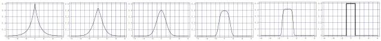

While the Gaussian model leads to least-squares related methods, this Laplacian model leads to absolute-values methods (see section4.5.2), well known for producing robust \( ^{12} \) results. More generally, there is the \( L_{p} \) model of uncertainties

\[
\rho_ {p} (\mathbf {d}) = k \exp \left(- \frac {1}{p} \sum_ {i} \frac {\left| d ^ {i} - d _ {\mathrm{obs}} ^ {i} \right| ^ {p}}{\left(\sigma^ {i}\right) ^ {p}}\right) \tag {38}
\]

(see figure 6). [END OF EXAMPLE.]

Figure 6: Generalized Gaussian for values of the parameter \( p = 1, \sqrt{2}, 2, 4, 8 \) and \( \infty \).

### 4.4 Joint ‘Prior’ Probability Distribution in the  \( (\mathcal{M},\mathcal{D}) \)  Space

We have just seen that the prior information on model parameters can be described by a probability density in the model space,  \( \rho_{m}(\mathbf{m}) \) , and that the result of measurements can be described by a probability density in the data space  \( \rho_{d}(\mathbf{d}) \) . As by 'prior' information on model parameters we mean information obtained independently from the measurements (it often represents information we had before the measurements were made), we can use the notion of independency of variables of section 2.6 to define a joint probability density in the  \( \mathcal{X} = (\mathcal{M}, \mathcal{D}) \)  space as the product of the two 'marginals'

\[
\rho (\mathbf {x}) = \rho (\mathbf {m}, \mathbf {d}) = \rho_ {m} (\mathbf {m}) \rho_ {d} (\mathbf {d}). \tag {39}
\]

Although we have introduced  \( \rho_{m}(\mathbf{m}) \)  and  \( \rho_{d}(\mathbf{d}) \)  separately, and we have suggested to build a probability distribution in the  \( (\mathcal{M},\mathcal{D}) \)  space by the multiplication 39, we may have more general situation where the information we have on m and on d is not independent. So, in what follows, let us assume that we have some information in the  \( \mathcal{X}=(\mathcal{M},\mathcal{D}) \)  space, represented by the 'joint' probability density

\[
\rho (\mathbf {x}) = \rho (\mathbf {m}, \mathbf {d}), \tag {40}
\]

and let us contemplate equation 39 as just a special case.

Let us in the rest of this paper denote by  \( \mu(\mathbf{x}) \)  the probability density representing the homogeneous probability distribution, as introduced in section 2.2. We may remember here the rule 8, stating that the limit of a consistent probability density must the homogeneous one, so we may formally write

\[
\mu (\mathbf {x}) = \lim _ {\text { infinite   dispersions }} \rho (\mathbf {x}). \tag {41}
\]

When the partition 39 holds, then, typically (see rule 8),

\[
\mu (\mathbf {x}) = \mu (\mathbf {m}, \mathbf {d}) = \mu_ {m} (\mathbf {m}) \mu_ {d} (\mathbf {d}). \tag {42}
\]

### 4.5 Physical Laws as Mathematical Functions

#### 4.5.1 Physical Laws

Physics analyzes the correlations existing between physical parameters. In standard mathematical physics, these correlations are represented by 'equalities' between physical parameters (like when we write \(\mathbf{F} = m\mathbf{a}\) to relate the force \(\mathbf{F}\) applied to a particle, the mass \(m\) of the particle and the acceleration \(\mathbf{a}\)). In the context of inverse problems this corresponds to assuming that we have a function from the 'parameter space' to the 'data space' that we may represent as

\[
\mathbf {d} = \mathbf {f} (\mathbf {m}). \tag {43}
\]

\( ^{12} \) A numerical method is called robust if it is not sensitive to a small number of large errors.

20