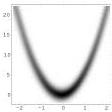
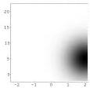
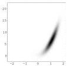

Example 18 In the 'Galilean law' example developed in section 4.6.1, we described the correlation between the position \( x \) and the time \( t \) of a free falling object through a probability density \( \vartheta(x,t) \). This law says that falling objects describe, approximately, a space-time parabola. Assume that in a particular experiment the falling object explodes at some point of its space-time trajectory \( A \) plain measurement of the coordinates \( (x,t) \) of the event gives the probability density \( \rho(x,t) \). By 'plain measurement' we mean here that we have used a measurement technique that is not taking into account the particular parabolic character of the fall (i.e., the measurement is designed to work identically for any sort of trajectory). The conjunction of the physical law \( \vartheta(x,t) \) and the experimental result \( \rho(x,t) \), using expression 68, gives

\[
\sigma (x, t) = k \frac {\rho (x , t) \vartheta (x , t)}{\mu (x , t)}, \tag {78}
\]

where, as the coordinates  \( (x,t) \)  are ‘Cartesian’,  \( \mu(x,t)=k \) . Taking the explicit expression given for  \( \vartheta(x,t) \)  in equations 63–64, with  \( \vartheta_{t}(t)=k \) ,

\[
\vartheta (x, t) = \frac {1}{\sqrt {2 \pi} \sqrt {\sigma_ {x} ^ {2} + \sigma_ {v} ^ {2} t ^ {2}}} \exp \left(- \frac {1}{2} \frac {\left(x - \left(x _ {0} + v _ {0} t + \frac {1}{2} g t ^ {2}\right)\right) ^ {2}}{\sigma_ {x} ^ {2} + \sigma_ {v} ^ {2} t ^ {2}}\right), \tag {79}
\]

and assuming the Gaussian form \( ^{19} \) for \( \rho(x,t) \),

\[
\rho (x, t) = \rho_ {x} (x) \rho_ {t} (t) = k \exp \left(- \frac {1}{2} \frac {(x - x _ {\mathrm{obs}}) ^ {2}}{\Sigma_ {x} ^ {2}}\right) \exp \left(- \frac {1}{2} \frac {(t - t _ {\mathrm{obs}}) ^ {2}}{\Sigma_ {t} ^ {2}}\right), \tag {80}
\]

we obtain the combined probability density

\[
\sigma (x, t) = \frac {k}{\sqrt {\sigma_ {x} ^ {2} + \sigma_ {v} ^ {2} t ^ {2}}} \exp \left(- \frac {1}{2} \left(\frac {(x - x _ {\mathrm{obs}}) ^ {2}}{\Sigma_ {x} ^ {2}} + \frac {(t - t _ {\mathrm{obs}}) ^ {2}}{\Sigma_ {t} ^ {2}} + \frac {(x - (x _ {0} + v _ {0} t + \frac {1}{2} g t ^ {2})) ^ {2}}{\sigma_ {x} ^ {2} + \sigma_ {v} ^ {2} t ^ {2}}\right)\right). \tag {81}
\]

Figure 7 illustrates the three probability densities \(\vartheta(x,t)\), \(\rho(x,t)\) and \(\sigma(x,t)\). See appendix C for a more detailed examination of this problem. [END OF EXAMPLE.]

Figure 7: This figure has been was made with the numerical values mentioned in figure 17 (see appendix C) with, in addition, \( x_{\mathrm{obs}} = 5.0\mathrm{m} \), \( \Sigma_x = 4.0\mathrm{m} \), \( t_{\mathrm{obs}} = 2.0\mathrm{s} \) and \( \Sigma_t = 0.75\mathrm{s} \).

## 5 Solving Inverse Problems (I): Examination of the Probability Density

The next two sections deal with Monte Carlo and optimization methods. The implementation of these methods takes some programming effort that is not required when we face problems with fewer degrees of freedom (say, between one to five).

When we have a small number of parameters we should directly 'plot' the probability density.

In appendix L the problem of estimation of a seismic hypocenter is treated, and it is shown there that the examination of the probability density for the location of the hypocenter offers a much better possibility for analysis than any other method.

\( ^{19} \) Note that taking the limit of  \( \vartheta(x,t) \)  or of  \( \rho(x,t) \)  for infinite variances we obtain  \( \mu(x,t) \) , as we should.

26