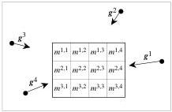
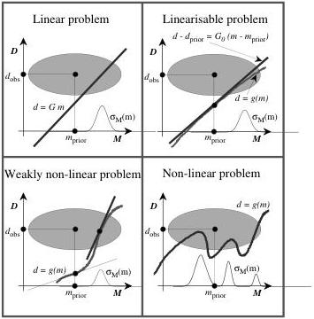

Figure 8: A simple example where we are interested in predicting the gravitational field g generated by a 2-D distribution of mass.

First, there are strictly linear problems. For instance, in the example illustrated by figure 8 the gravitational field g depends linearly on the masses inside the blocks \( ^{26} \)

Figure 9: Illustration of the four domains of nonlinearity, calling for different optimization algorithms. The model space is symbolically represented by the abscissa, and the data space is represented by the ordinate. The gray oval represents the combination of prior information on the model parameters, and information from the observed data. What is important is not an intrinsic nonlinearity of the function relating model parameters to data, but how linear the function is inside the domain of significant probability.

Strictly linear problems are illustrated at the top left of figure 9. The linear relationship between data and model parameters, \(\mathbf{d} = \mathbf{G}\mathbf{m}\), is represented by a straight line. The prior probability density \(\rho (\mathbf{d},\mathbf{m})\) "induces" on this straight line the posterior probability density\(^{27}\) \(\sigma (\mathbf{d},\mathbf{m})\) whose "projection" over the model space gives gives the posterior probability density over the model parameter space, \(\sigma_{m}(\mathbf{m})\). Should the prior probability densities be Gaussian, then the posterior probability distribution would also be Gaussian: this is the simplest

\( ^{26} \) The gravitational field at point  \( x_{0} \)  generated by a distribution of volumetric mass  \( \rho(\mathbf{x}) \)  is given by

\[
\mathbf {g} (\mathbf {x} _ {0}) = \int d V (\mathbf {y}) \frac {\mathbf {x} _ {0} - \mathbf {y}}{\| \mathbf {x} _ {0} - \mathbf {x} \| ^ {3}} \rho (\mathbf {x}).
\]

When the volumetric mass is constant inside some predefined (2-D) volumes, as suggested in figure 8, this gives

\[
\mathbf {g} (\mathbf {x} _ {0}) = \sum_ {A} \sum_ {B} \mathbf {G} ^ {\mathrm{A,B}} (\mathbf {x} _ {0}) m ^ {\mathrm{A,B}}.
\]

This is a strictly linear equation between data (the gravitational field at a given observation point) and the model parameters (the masses inside the volumes). Note that if instead of choosing as model parameters the total masses inside some predefined volumes one chooses the geometrical parameters defining the sizes of the volumes, then the gravity field is not a linear function of the parameters. More details can be found in Tarantola and Valette (1982b, page 229).

\( ^{27} \) using the ‘orthogonal-limit’ method described in section 2.4.

33