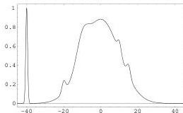
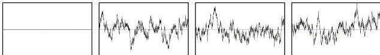

Figure 10: One of the circumstances where the 'maximum likelihood model' may not be very interesting is when it corresponds to a narrow maximum with small total probability, as the peak in the left part of this probability distribution.

Figure 11: At the right, three random realizations of a Gaussian random function with zero mean and (approximately) exponential correlation function. The most likely function, i.e., the center of the Gaussian, is shown at the left. We see that the most likely function is not a representative of the probability distribution.

## 8 Conclusions

Probability theory is well adapted to the formulation of inverse problems, although its formulation must be rendered intrinsic (introducing explicitly the definition of distances in the working spaces, by redefining the notion of conditional probability density, and by introducing the notion of conjunction of states of information). The Metropolis algorithm is well adapted to the solution of inverse problems, as its inherent structure allows us to sequentially combine prior information, theoretical information, etc., and allows us to take advantage of the 'movie philosophy'. When a general Monte Carlo approach cannot be afforded, one can use simplified optimization techniques (like least squares). However, this usually requires strong simplifications that can only be made at the cost of realism.

## 9 Acknowledgements

We are very indebted to our colleagues (Bartolomé Coll, Miguel Bosch, Guillaume Évrard, John Scales, Christophe Barnes, Frédéric Parrenin and Bernard Valette) for illuminating discussions. We are also grateful to the students of the Geophysical Tomography Group, and the students at our respective institutes (in Paris and Copenhagen).

## 10 Bibliography

Aki, K. and Lee, W.H.K., 1976, Determination of three-dimensional velocity anomalies under a seismic array using first P arrival times from local earthquakes, J. Geophys. Res., **81**, 4381–4399.
Aki, K., Christofferson, A., and Husebye, E.S., 1977, Determination of the three-dimensional seismic structure of the lithosphere, J. Geophys. Res., **82**, 277-296.
Backus, G., 1970a. Inference from inadequate and inaccurate data: I, Proceedings of the National Academy of Sciences, 65, 1, 1-105.
Backus, G., 1970b. Inference from inadequate and inaccurate data: II, Proceedings of the National Academy of Sciences, 65, 2, 281-287.
Backus, G., 1970c. Inference from inadequate and inaccurate data: III, Proceedings of the National Academy of Sciences, 67, 1, 282-289.
Backus, G., 1971. Inference from inadequate and inaccurate data, Mathematical problems in the Geophysical Sciences: Lecture in applied mathematics, 14, American Mathematical Society, Providence, Rhode Island.
Backus, G., and Gilbert, F., 1967. Numerical applications of a formalism for geophysical inverse problems, Geophys. J. R. astron. Soc., 13, 247-276.

35