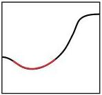
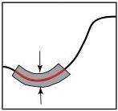

Conditional Probability

Figure 12: Definition of conditional volumetric probability (or conditional probability density).

Assume, for instance, the hypersurface we consider is defined by the explicit equation

\[
\mathbf {v} = \mathbf {v} (\mathbf {u}) \quad , \tag {128}
\]

and let be

\[
\mathbf {g} = \left( \begin{array}{l l} \mathbf {g} _ {u u} & \mathbf {g} _ {u v} \\ \mathbf {g} _ {v u} & \mathbf {g} _ {v v} \end{array} \right) \tag {129}
\]

the metric of the space. Consider, then, a 'joint' volumetric probability \( F(\mathbf{u},\mathbf{v}) \), or, equivalently, a 'joint' probability density \( f(\mathbf{u},\mathbf{v}) \).

It can be shown, using the standard techniques of differential geometry, that the conditional volumetric probability over the submanifold \(\mathbf{v} = \mathbf{v}(\mathbf{u})\) can be expressed as

\[
F (\mathbf {u} | \mathbf {v} = \mathbf {v} (\mathbf {u})) = k F (\mathbf {u}, \mathbf {v} (\mathbf {u})) \left. \frac {\sqrt {\det \left(\mathbf {g} _ {u u} + \mathbf {g} _ {u v} \mathbf {V} + \mathbf {V} ^ {T} \mathbf {g} _ {v u} + \mathbf {V} ^ {T} \mathbf {g} _ {v v} \mathbf {V}\right)}}{\sqrt {\det \mathbf {g} _ {u u}}} \right| _ {\mathbf {v} = \mathbf {v} (\mathbf {u})}, \tag {130}
\]

while the conditional probability density is

\[
f (\mathbf {u} | \mathbf {v} = \mathbf {v} (\mathbf {u})) = k f (\mathbf {u}, \mathbf {v} (\mathbf {u})) \left. \frac {\sqrt {\det \left(\mathbf {g} _ {u u} + \mathbf {g} _ {u v} \mathbf {V} + \mathbf {V} ^ {T} \mathbf {g} _ {v u} + \mathbf {V} ^ {T} \mathbf {g} _ {v v} \mathbf {V}\right)}}{\sqrt {\det \mathbf {g}}} \right| _ {\mathbf {v} = \mathbf {v} (\mathbf {u})}. \tag {131}
\]

In these two equations, \(\mathbf{V} = \mathbf{V}(\mathbf{u})\) is the matrix of partial derivatives

\[
\left( \begin{array}{c c c c} V _ {1 1} & V _ {1 2} & \dots & V _ {1 p} \\ V _ {2 1} & V _ {2 2} & \dots & V _ {2 p} \\ \vdots & \vdots & \ddots & \vdots \\ V _ {q 1} & V _ {q 2} & \dots & V _ {q p} \end{array} \right) = \left( \begin{array}{c c c c} \frac {\partial v _ {1}}{\partial u _ {1}} & \frac {\partial v _ {1}}{\partial u _ {2}} & \dots & \frac {\partial v _ {1}}{\partial u _ {p}} \\ \frac {\partial v _ {2}}{\partial u _ {1}} & \frac {\partial v _ {2}}{\partial u _ {2}} & \dots & \frac {\partial v _ {2}}{\partial u _ {p}} \\ \vdots & \vdots & \ddots & \vdots \\ \frac {\partial v _ {q}}{\partial u _ {1}} & \frac {\partial v _ {q}}{\partial u _ {2}} & \dots & \frac {\partial v _ {q}}{\partial u _ {p}} \end{array} \right). \tag {132}
\]

### B.2 Marginal Probability

The starting point here is the same as above, where the probability \( Q_{\delta} \) is defined by equation 126, but now we take the limit when \( \delta \) grows indefinitely (see figure 13).

Formally, we define the marginal probability over the submanifold \(\mathcal{M}_p\) as the limit of \(Q_{\delta}\) for \(\delta \to \infty\):

\[
Q (\mathcal {A} _ {p}) = \lim _ {\delta \rightarrow \infty} \frac {P (\mathcal {A} _ {n} (\delta))}{P (\mathcal {M} _ {n} (\delta))}. \tag {133}
\]

It is clear that this limit will make sense only in special circumstances. Figure 14, for instance, suggests the case of a linear submanifold in an Euclidean space, and the case of a geodesic submanifold in an space with constant curvature. While in the Euclidean space, the limit \(\delta \to \infty\) can actually be taken, in the spherical case, the limit is only taken up to the pole of the sphere (where all geodesics orthogonal to a geodesic submanifold meet).

If, in the Euclidean example, we use Cartesian coordinates, we have (e.g. in 2D)

\[
f _ {x} (x) = \int_ {- \infty} ^ {+ \infty} d y f (x, y), \tag {134}
\]

39