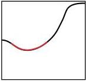
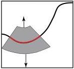
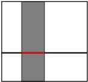
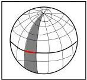

Marginal Probability

Figure 13: Definition of marginal volumetric probability (or marginal probability density.

Figure 14: Two special cases where one can obtain an explicit expression for the marginal volumetric probability (or marginal probability density): in the Euclidean plane over a straight line or on the surface of the sphere, on a great circle.

Marginal Probability (special cases)

equation valid for both, probability densities and volumetric probabilities.

Over the 2D sphere, using colatitude \(\lambda\) and longitude \(\varphi\), if we compute the marginal of a probability over the equator we obtain

\[
f _ {\varphi} (\varphi) = \int_ {- \pi / 2} ^ {+ \pi / 2} d \lambda f (\lambda , \varphi) \quad \text {(probability densities)} \tag {135}
\]

or, equivalently,

\[
F _ {\varphi} (\varphi) = \int_ {- \pi / 2} ^ {+ \pi / 2} d L (\lambda) F (\lambda , \varphi) \quad \text {(volumetric probabilities)} \tag {136}
\]

where

\[
d L (\lambda) = \cos \lambda d \lambda . \tag {137}
\]

In the case where we build the total space using the Cartesian product of two spaces \(\mathcal{U} \times \mathcal{V}\), with

\[
d V (\mathbf {u}, \mathbf {v}) = d V _ {u} (\mathbf {u}) d V _ {v} (\mathbf {v}), \tag {138}
\]

then, from a joint volumetric probability \( F(\mathbf{u},\mathbf{v}) \) we can intrinsically define the two marginal volumetric probabilities

\[
F _ {u} (\mathbf {u}) = \int_ {v} d V (\mathbf {v}) F (\mathbf {u}, \mathbf {v}) \quad ; \quad F _ {v} (\mathbf {v}) = \int_ {u} d V (\mathbf {u}) F (\mathbf {u}, \mathbf {v}) \tag {139}
\]

or, equivalently, from a joint probability density \( f(\mathbf{u},\mathbf{v}) \) we can obtain the two marginal probability densities

\[
f _ {u} (\mathbf {u}) = \int_ {v} d \mathbf {v} f (\mathbf {u}, \mathbf {v}) \quad ; \quad f _ {v} (\mathbf {v}) = \int_ {u} d \mathbf {u} f (\mathbf {u}, \mathbf {v}). \tag {140}
\]

## C Combining Data and Theories: a Conceptual Example

In this section the same basic problem is solved in four different circumstances. As we shall see, each circumstance forces the use of a different approach.

The basic problem is the following. A particle follows a simple trajectory in space-time, the characteristics of the trajectory being not known a priori. An 'event' happens on the trajectory (like the particle emitting a light signal), and we use some experimental equipment to measure the space-time coordinates \((x,t)\) of the event. As there are always some experimental uncertainties, we may assume, with some generality, that the result of the

40