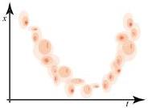
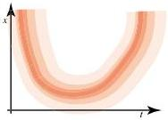
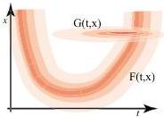
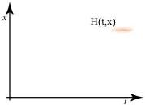

measurement can be described using a probability density $g(t,x)$. In particular, we have some information on $t$, as represented by the marginal probability density $g_t(t) = \int_{-\infty}^{+\infty} dx \, g(x,t)$, and some information on $x$, as represented by the marginal probability density $g_x(x) = \int_{-\infty}^{+\infty} dt \, g(x,t)$. Now, the characteristics of the trajectory are given to us. This extra information can be used to ameliorate our knowledge on $x$ and $t$, defining some new probability densities $h_t(t)$ and $h_x(x)$ that may have smaller uncertainties than the experimentally obtained $g_t(t)$ and $g_x(x)$.

As an example, the trajectory of the particle is assumed to be a free-fall trajectory in a space with constant gravity field$^{29}$.

### C.1 Contemplative Approach (Conjunction of Probabilities)

Imagine that we have a “blinking mass in free-fall”, i.e., a mass that is in free fall and which emits intermittent flashes. We do not know if the flashes are emitted at constant time intervals, or at constant position intervals, or with some other predetermined or random sequence.

Figure 15: Measuring the position of blinking masses. Top: measurement (with uncertainties) of the blinks of a single mass. Bottom: the ‘addition’ of the measurements of a great number of similar blinking masses.

Figure 16: A ‘measurement’ $G(x,t)$ can be refined by combining it with the ‘law’ $F(x,t)$. See equation 161.

$^{29}$We shall assume Newtonian physics or special relativity, and shall not enter in the complications induced by the curved space-time of general relativity.

41