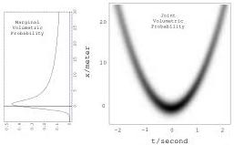
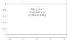
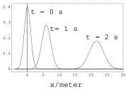

As the particle is prepared to desintegrate at some instant \( t \) chosen homogeneously at random, the joint probability density is

\[
f (t, x) = k f (x | t). \tag {160}
\]

This probability density is represented in figure 17, together with the two marginals, and the conditional probability density at three different times is represented in figure 18.

Figure 17: A typical parabola representing the free fall of an object (position x as a function of time t). Here, rather than an infinitely thin line we have a fuzzy object (a probability distribution) because the initial position and initial velocity is uncertain. This figure represents the probability density defined by equations 159–160, with  \( x_{0}=0 \) ,  \( v_{0}=1\ m/s \) ,  \( \sigma_{x}=1\ m \) ,  \( \sigma_{v}=1\ m/s \)  and  \( g=9.91\ m/s^{2} \) . While, by definition, the marginal of the probability density with respect to the time t is homogeneous, the marginal for the position x is not: there is a pronounced maximum for x=0 (when the falling object is slower), and the distribution is very asymmetric (as the object is falling ‘downwards’).

Figure 18: Three conditional probability densities from the joint distribution of the previous figure at times t = 0, t = 1s and t = 2s. The width increases with time because of the uncertainty in the initial velocity.

Consider a new blink of a new particle. A measurement of this particular blink gives the probability density  \( g(t,x) \) . To ‘combine’ the ‘law’  \( f(t,x) \)  with the ‘measurement’  \( g(t,x) \) , means to use the AND operation (note that, here, as we use Galilean coordinates, the homogeneous probability density is a constant):

\[
h (t, x) = k f (t, x) g (t, x). \tag {161}
\]

Let us evaluate the marginal

\[
h _ {t} (t) = \int d x h (t, x) = k \int d x f (t, x) g (t, x). \tag {162}
\]

For sufficiently small \(\sigma_{x}\) and \(\sigma_{v}\), we have the approximation

\[
h _ {t} (t) \approx k \frac {1}{\sqrt {\sigma_ {x} ^ {2} + \sigma_ {v} ^ {2} t ^ {2}}} g (t, x (t)) \quad , \tag {163}
\]

where \(x(t)\) is defined as

\[
x (t) = x _ {0} + v _ {0} t + \frac {1}{2} g t ^ {2}. \tag {164}
\]

We can take two limits here. If \(\sigma_x \to 0\), then, for whatever value of \(\sigma_v\) (but that was assumed above to be small), we have, redefining the constant \(k\),

\[
h _ {t} (t) = k \frac {1}{t} g (t, x (t)) \quad . \tag {165}
\]

44