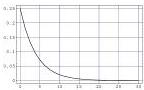
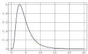
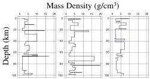

Figure 19: At left, the probability density for the layer thickness. At right, the probability density for the density of mass.

Depth (km)

Mass Density (g/cm \( ^{3} \) )

where the constant  \( \ell_{0} \)  has the value  \( \ell_{0}=4 \)  km (see the left of figure 19), while all the marginal prior probability densities for the mass density are also assumed to be identical and of the form (log-normal probability density)

\[
g (\rho) = \frac {1}{\sqrt {2 \pi} \sigma} \frac {1}{\rho} \exp \left(- \frac {1}{2 \sigma^ {2}} \left(\log \frac {\rho}{\rho_ {0}}\right) ^ {2}\right), \tag {170}
\]

where \(\rho_0 = 3.98\mathrm{g / cm}^3\) and \(\sigma = 0.58\) (see the right of figure 19).

Assuming that the probability distribution of any layer thickness is independent of the thicknesses of the other layers, that the probability distribution of any mass density is independent of the mass densities of the other layers, and that layer thicknesses are independent of mass densities, the prior probability density in this problem is the product of prior probability densities (equations 169 and 170) for each parameter,

\[
\rho_ {\mathcal {M}} (\mathbf {m}) = \rho_ {\mathcal {M}} (\ell_ {1}, \ell_ {2}, \dots , \ell_ {N L}, \rho_ {1}, \rho_ {2}, \dots , \rho_ {N L}) = k \prod_ {i} ^ {N L} f (\rho_ {i}) g (\rho_ {i}). \tag {171}
\]

Figure 20 shows (pseudo-) random models generated according to this probability distribution. Of course, the explicit expression 171 has not been used to generate these random models. Rather, consecutive layer thicknesses and consecutive mass densities have been generated using the univariate probability densities defined by equations 169 and 170.

Figure 20: Three random Earth models generated according to the prior probability density in the model space.

## F Gaussian Linear Problems

If the ‘relation solving the forward problem’  \( \mathbf{d} = \mathbf{f}(\mathbf{m}) \)  happens to be a linear relation,

\[
\mathbf {d} = \mathbf {F m}, \tag {172}
\]

then the probability density  \( \sigma_{m}(\mathbf{m}) \)  in equation 50 becomes \( ^{31} \)

\[
\sigma_ {m} (\mathbf {m}) = \tag {173}
\]

\[
k \exp \left(- \frac {1}{2} \left((\mathbf {m} - \mathbf {m} _ {\mathrm{prior}}) ^ {t} \mathbf {C} _ {M} ^ {- 1} (\mathbf {m} - \mathbf {m} _ {\mathrm{prior}}) + (\mathbf {F m} - \mathbf {d} _ {\mathrm{obs}}) ^ {t} \mathbf {C} _ {D} ^ {- 1} (\mathbf {F m} - \mathbf {d} _ {\mathrm{obs}})\right)\right).
\]

As the argument of the exponential is a quadratic function of \(\mathbf{m}\) we can write it in standard form,

\[
\sigma (\mathbf {m}) = k \exp \left(- \frac {1}{2} \left((\mathbf {m} - \bar {\mathbf {m}}) ^ {T} \bar {\mathbf {C}} _ {M} ^ {- 1} (\mathbf {m} - \bar {\mathbf {m}})\right)\right), \tag {174}
\]

\( ^{31} \) The last multiplicative factor in equation 50 is a constant that can be integrated into the constant k.

46