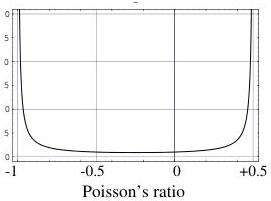

that corresponds, in the variables \((\kappa, \mu)\), to

\[
d s ^ {2} = \left(\frac {d \kappa}{\kappa}\right) ^ {2} + \left(\frac {d \mu}{\mu}\right) ^ {2}, \tag {193}
\]

i.e., to the metric

\[
\left( \begin{array}{c c} g _ {\kappa \kappa} & g _ {\kappa \mu} \\ g _ {\mu \kappa} & g _ {\mu \mu} \end{array} \right) = \left( \begin{array}{c c} 1 / \kappa^ {2} & 0 \\ 0 & 1 / \mu^ {2} \end{array} \right). \tag {194}
\]

### H.2 Young Modulus and Poisson Ratio

The Young modulus \( Y \) and the Poisson ration \( \sigma \) can be expressed as a function of the uncompressibility modulus and the shear modulus as

\[
Y = \frac {9 \kappa \mu}{3 \kappa + \mu}; \quad \sigma = \frac {1}{2} \frac {3 \kappa - 2 \mu}{3 \kappa + \mu} \tag {195}
\]

or, reciprocally,

\[
\kappa = \frac {Y}{3 (1 - 2 \sigma)}; \quad \mu = \frac {Y}{2 (1 + \sigma)}. \tag {196}
\]

The absolute value of the Jacobian of the transformation is easily computed,

\[
J = \frac {Y}{2 (1 + \sigma) ^ {2} (1 - 2 \sigma) ^ {2}}, \tag {197}
\]

and the Jacobian rule transforms the probability density 191 into

\[
f _ {Y \sigma} (Y, \sigma) = \frac {1}{\kappa \mu} J = \frac {3}{Y (1 + \sigma) (1 - 2 \sigma)}, \tag {198}
\]

which is the probability density representing the homogeneous probability distribution for elastic parameters using the variables \((Y,\sigma)\). This probability density is the product of the probability density \(1 / Y\) for the Young modulus and the probability density

\[
g (\sigma) = \frac {3}{Y (1 + \sigma) (1 - 2 \sigma)} \tag {199}
\]

for the Poisson ratio. This probability density is represented in figure 21. From the definition of \(\sigma\) it can be demonstrated that its values must range in the interval \(-1 < \sigma < 1/2\), and we see that the homogeneous probability density is singular at these points. Although most rocks have positive values of the Poisson ratio, there are materials where \(\sigma\) is negative (e.g., Yeganeh-Haeri et al., 1992).

Figure 21: The homogeneous probability density for the Poisson ratio, as deduced from the condition that the uncompressibility and the shear modulus are Jeffreys parameters.

It may be surprising that the probability density in figure 21 corresponds to a homogeneous distribution. If we have many samples of elastic materials, and if their logarithmic uncompressibility modulus \(\kappa^{*}\) and their logarithmic shear modulus \(\mu^{*}\) have a constant probability density (what is the definition of homogeneous distribution of elastic materials), then, \(\sigma\) will be distributed according to the \(g(\sigma)\) of the figure.

51