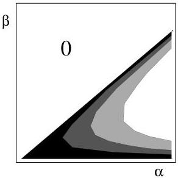

Let us focus for a moment on the homogeneous probability density for the two wave velocities \((\alpha, \beta)\) existing in an elastic solid (disregard here the mass density \(\rho\)). We have

\[
f _ {\alpha \beta} (\alpha , \beta) = \frac {1}{\alpha \beta \left(\frac {3}{4} - \frac {\beta^ {2}}{\alpha^ {2}}\right)}. \tag {209}
\]

It is displayed in figure 22.

Figure 22: The joint homogeneous probability density for the velocities  \( (\alpha,\beta) \)  of the longitudinal and transverse waves propagating in an elastic solid. Contrary to the incompressibility and the shear modulus, that are independent parameters, the longitudinal wave velocity and the transversal wave velocity are not independent (see text for an explanation). The scales for the velocities are unimportant: it is possible to multiply the two velocity scales by any factor without modifying the form of the probability (which is itself defined up to a multiplicative constant).

Let us demonstrate that the marginal probability density for both \(\alpha\) and \(\beta\) is of the form \(1 / x\). For we have to compute

\[
f _ {\alpha} (\alpha) = \int_ {0} ^ {\sqrt {3} \alpha / 2} d \beta f (\alpha , \beta) \tag {210}
\]

and

\[
f _ {\beta} (\beta) = \int_ {2 \beta / \sqrt {3}} ^ {+ \infty} d \alpha f (\alpha , \beta) \tag {211}
\]

(the bounds of integration can easily be understood by a look at figure 22). These integrals can be evaluated as

\[
f _ {\alpha} (\alpha) = \lim _ {\varepsilon \rightarrow 0} \int_ {\sqrt {\varepsilon} \sqrt {3} \alpha / 2} ^ {\sqrt {1 - \varepsilon} \sqrt {3} \alpha / 2} d \beta f (\alpha , \beta) = \lim _ {\varepsilon \rightarrow 0} \left(\frac {4}{3} \log \frac {1 - \varepsilon}{\varepsilon}\right) \frac {1}{\alpha} \tag {212}
\]

and

\[
f _ {\beta} (\beta) = \lim _ {\varepsilon \rightarrow 0} \int_ {\sqrt {1 + \varepsilon} 2 \beta / \sqrt {3}} ^ {2 \beta / (\sqrt {\varepsilon} \sqrt {3})} d \alpha f (\alpha , \beta) = \lim _ {\varepsilon \rightarrow 0} \left(\frac {2}{3} \log \frac {1 / \varepsilon - 1}{\varepsilon}\right) \frac {1}{\beta}. \tag {213}
\]

The numerical factors tend to infinity, but this is only one more manifestation of the fact that the homogeneous probability densities are usually improper (not normalizable). Dropping these numerical factors gives

\[
f _ {\alpha} (\alpha) = \frac {1}{\alpha} \tag {214}
\]

and

\[
f _ {\beta} (\beta) = \frac {1}{\beta}. \tag {215}
\]

It is interesting to note that we have here an example where two parameters that look like Jeffreys parameters, but are not, because they are not independent (the homogeneous joint probability density is not the product of the homogeneous marginal probability densities.).

53