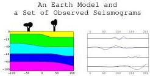

It is also worth to know that using slownesses instead of velocities ( \( n = 1/\alpha, \eta = 1/\beta \) ) leads, as one would expect, to

\[
f _ {n \eta \rho} (n, \eta , \rho) = \frac {1}{\rho n \eta \left(\frac {3}{4} - \frac {n ^ {2}}{\eta^ {2}}\right)}. \tag {216}
\]

## I Homogeneous Distribution of Second Rank Tensors

The usual definition of the norm of a tensor provides the only natural definition of distance in the space of all possible tensors. This shows that, when using a Cartesian system of coordinates, the components of a tensor are the 'Cartesian coordinates' in the 6D space of symmetric tensors. The homogeneous distribution is then represented by a constant (nonnormalizable) probability density:

\[
f \left(\sigma_ {x x}, \sigma_ {y y}, \sigma_ {z z}, \sigma_ {x y}, \sigma_ {y z}, \sigma_ {z x}\right) = k. \tag {217}
\]

Instead of using the components, we may use the three eigenvalues \(\{\lambda_1,\lambda_2,\lambda_3\}\) of the tensor and the three Euler angles \(\{\psi ,\theta ,\varphi \}\) defining the orientation of the eigendirections in the space. As the Jacobian of the transformation

\[
\left\{\sigma_ {x x}, \sigma_ {y y}, \sigma_ {z z}, \sigma_ {x y}, \sigma_ {y z}, \sigma_ {z x} \right\} \rightleftharpoons \left\{\lambda_ {1}, \lambda_ {2}, \lambda_ {3}, \psi , \theta , \varphi \right\} \tag {218}
\]

is

\[
\left| \frac {\partial (\sigma_ {x x} , \sigma_ {y y} , \sigma_ {z z} , \sigma_ {x y} , \sigma_ {y z} , \sigma_ {z x})}{\partial (\lambda_ {1} , \lambda_ {2} , \lambda_ {3} , \psi , \theta , \varphi)} \right| = (\lambda_ {1} - \lambda_ {2}) (\lambda_ {2} - \lambda_ {3}) (\lambda_ {3} - \lambda_ {1}) \sin \theta , \tag {219}
\]

the homogeneous probability density 217 transforms into

\[
g (\lambda_ {1}, \lambda_ {2}, \lambda_ {3}, \psi , \theta , \varphi) = k (\lambda_ {1} - \lambda_ {2}) (\lambda_ {2} - \lambda_ {3}) (\lambda_ {3} - \lambda_ {1}) \sin \theta . \tag {220}
\]

Although this is not obvious, this probability density is isotropic in spatial directions (i.e., the 3D referentials defined by the three Euler angles are isotropically distributed). In this sense, we recover 'isotropy' as a special case of 'homogeneity'.

The rule 8, imposing that any probability density on the variables \(\{\lambda_1,\lambda_2,\lambda_3,\psi ,\theta ,\varphi \}\) has to tend to the homogeneous probability density 220 when the 'dispersion parameters' tend to infinity imposes a strong constraint on the form of acceptable probability densities, that is, generally, overlooked.

For instance, a Gaussian model for the variables \(\{\sigma_{xx},\sigma_{yy},\sigma_{zz},\sigma_{xy},\sigma_{yz},\sigma_{zx}\}\) is consistent (as the limit of Gaussian is a constant). This induces, via the Jacobian rule, a probability density for the variables \(\{\lambda_1,\lambda_2,\lambda_3,\psi ,\theta ,\varphi \}\), a probability density that is not simple, but consistent. A Gaussian model for the parameters \(\{\lambda_1,\lambda_2,\lambda_3,\psi ,\theta ,\varphi \}\) would not be consistent.

## J Example of Ideal (Although Complex) Geophysical Inverse Problem

Assume we wish to explore a complex medium, like the Earth's crust, using elastic waves. Figure 23 suggests an Earth model and a set of seismograms produced by the waves generated by an earthquake (or an artificial source). The seismometers (not represented) may be at the Earth's surface or inside boreholes. Although only four seismograms are displayed, actual experiments may generate thousands or millions of them. The problem here is to use a set of observed seismograms to infer the structure of the Earth.

Figure 23: A set of observed seismograms (at the right) is to be used to infer the structure of the Earth (at the left). A couple of trees suggest an scale (the numbers could correspond to meters), although the same principle can be used for global Earth tomography.

The first step is to define the set of parameters to be used to represent an Earth model. These parameters have to qualitatively correspond to the ideas we have about the Earth's interior: Thickness and curvature of the

54