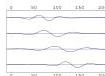
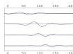
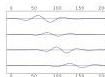
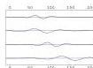
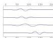
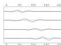
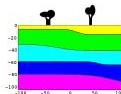

# Theoretical Sets of Seismograms
(inside theoretical
uncertainties)

Figure 24: Given an arbitrary Earth model $\mathbf{m}$, a (non exact) theory given a probability distribution for the data, $\vartheta(\mathbf{d}|\mathbf{m})$, than can be sampled, producing the sets of seismograms shown here.

56