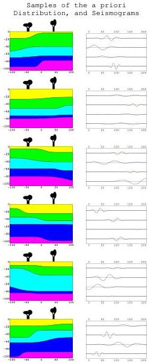

priori information we have over the model space is not easily expressible as an explicit expression of a volumetric probability. Rather, a large set of rules, some of them probabilistic, is expressed.

Already, the very definition of the parameters contains a fundamental topological information (the type of objects being considered: geological layers, faults, etc.). Then, we may have rules of the type 'a sedimentary layer may never be below a layer of igneous origin' or 'with probability 2/3, a layer with a thickness larger than D is followed by a layer with a thickness smaller than d', etc. There are, also, explicit volumetric probabilities, like 'the joint volumetric probability for porosity π and rigidity μ for a calcareous layer is g(π, μ) = ...'. They may come from statistical studies made using large petrophysical data banks, or from qualitative 'Bayesian' estimations of the correlations existing between different parameters.

Figure 25: Samples of the a priori distribution of Earth models, each accompanied by the predicted set of seismograms. A set of rules, some deterministic, some random, is used to randomly generate Earth models. These are assumed to be samples from a probability distribution over the model space corresponding to a volumetric probability ρm(m) whose explicit expression may be difficult to obtain. But it is not this expression that is required for proceeding with the method, only the possibility of obtaining as many samples of it as we may wish. Although a large number of samples may be necessary to grasp all the details of a probability distribution, as few as the six samples shown here already provide some elementary information. For instance, there are always five geological layers, separated by smooth interfaces. In each model, all the four interfaces are dipping 'leftwards' or all the four are dipping 'rightwards'. These observations may be confirmed, and other properties become conspicuous as more and more samples are displayed. The theoretical set of the seismograms associated to each model, displayed at right, are as different as the models are different. These are only 'schematic' seismograms, bearing no relation with any actual situation.

The fundamental hypothesis of the approach that follows is that we are able to use this set of rules to randomly generate Earth models. And as many as may wish. Figure 25 suggests the results obtained using such a procedure. In a computer screen, when the models are displayed one after the other, we have a 'movie'. A geologist (knowing nothing about mathematics) should, when observing such a movie for long enough, agree with a sentence like the following. All models displayed are possible models; the more likely models appear quite frequently; some unlikely models appear, but unfrequently; if we wait long enough we may well reach a model that may be arbitrarily close to

57