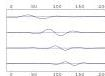
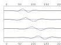
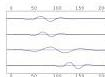
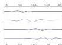
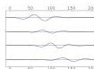
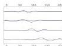
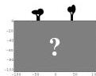

# Acceptable Sets of Seismograms  
(inside experimental  
uncertainties)

Figure 26: We have one ‘observed set of seismograms’, together with a description of the uncertainties in the data. The corresponding probability distribution may be complex (correlation of uncertainties, non Gaussianity of the noise, etc.). Rather than plotting the ‘observed set of seismograms’, pseudorandom realizations of the probability distribution in the data space are displayed here.

59