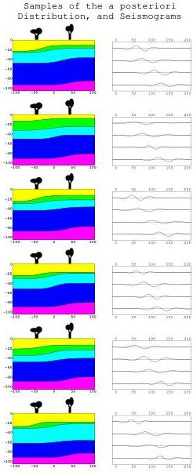

Figure 27: Samples of the a posteriori distribution of Earth models, each accompanied by the predicted set of seismograms. Note that, contrary to what happens with the a priori samples, all the models presented here have 'left dipping interfaces'. The second layer is quite thin. Etc.

60