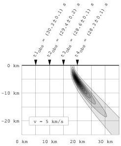
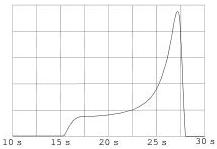

Here, we ask Mathematica NOT to try to evaluate analytically the result, but to perform a numerical computation (as we have checked that no analytical result is found). We use the 'a priori information' that the hypocenter must be inside a region \(0 < X < 60\mathrm{km}\), \(0 < Z < 50\mathrm{km}\) but limiting the integration domain to that area (see example 25). To represent the result, we enter the command

p = Table[0,{i,1,400}];
Do[ p[[i]] = sigmaT[i/10.] , {i,100,300}]
ListPlot[ p,PlotJoined->True, PlotRange->{{100,300},All}]

and the produced result is shown (after some editing) in figure 29. The software was not very stable in producing the results of the numerical integration.

Figure 28: The probability density for the location of the hypocenter. Its asymmetric shape is quite typical, as seismic observatories tend to be asymmetrically placed.

Figure 29: The marginal probability density for the origin time. The asymmetry seen in the probability density in figure 28, where the decay of probability is slow downwards, translates here in significant probabilities for early times. The sharp decay of the probability density for t < 17s does not come from the values of the arrival times, but from the a priori information that the hypocenters must be above the depth Z = -50 km.

### L.6 An Example of Bimodal Probability Density for an Arrival Time.

As an exercise, the reader could reformulate the problem replacing the assumption of Gaussian uncertainties in the arrival times by multimodal probability densities. For instance, figure 5 suggested the use of a bimodal probability density for the reading of the arrival time of a seismic wave. Using the Mathematica software, the command

rho[t_] := (If[8.0<t<8.8,5,1] If[9.8<t<10.2,10,1])

defines a probability density that, when plotted using the command

Plot[ rho[t], {t, 7, 11} ]

produces the result displayed in figure 30.

64