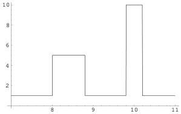

Figure 30: In figure 5 it was suggested that the probability density for the arrival time of a seismic phase may be multimodal. This is just an example to show that it is quite easy to define such multimodal probability densities in computer codes, even if they are not analytic.

# M Functional Inverse Problems

## M.1 Introduction

The main concern of this article is with discrete problems, i.e., problems where the number of data/parameters is finite. When functions are involved, it was assumed that a sampling of the function could be made that was fine enough for subsequent refinements of the sampling having no effect on the results. This, of course, means replacing any step (Heaviside) function by a sort of discretized Erf function$^{34}$. The limit of a very steep Erf function being the step function, any functional operation involving the Erf will have as limit the same functional operation involving the step (unless very pathological problems are considered).

The major reason for this limitation is that probability theory is easily developed in finite-dimensional spaces, but not in infinite-dimensional spaces. In fact, the only practical infinite-dimensional probability theory, where 'measures' are replaced by 'cylinder measures', is nothing but the assumption that the probabilities calculated have a well behaved limit when the dimensions of the space tend to infinity. Then, the 'cylinder measure' or 'probability' of a region of the infinite-dimensional space is defined as the limit of the probability calculated in a finite-dimensional subspace, when the dimensions of this subspace tend to infinity.

There are, nevertheless, some parcels of the theory whose generalization to the infinite dimensional case is possible and well understood. For instance, infinite dimensional Gaussian probability distributions have been well studied. This is not well surprised, because the random realizations of an infinite dimensional Gaussian probability distribution are $L_2$ functions, la crème de la crème of the functions.

Most of what will be said here will concern $L_2$ functions$^{35}$, and formulas presented will be the functional equivalent to the least-squares formalism developed above for discrete problems. In fact, most results will be valid for $L_p$ functions. The difference, of course, between an $L_2$ space and an $L_p$ space is the existence of an scalar product in the $L_2$ spaces, scalar product intimately related, as we will see, with the covariance operator typical of Gaussian probability distributions.

We face here an unfortunate fact that plagues some mathematical literature: the abuse of the term 'adjoint operator' where the simple 'transpose operator' would suffice. As we will see below, the transposed of a linear operator is something as simple as the original operator (like the transpose of a matrix is as simple as the original matrix), but the adjoint of an operator is a different thing. It is defined only in spaces that have a scalar product (i.e., in $L_2$ spaces), and depends essentially of the particular scalar product of the space. As the scalar product is, usually, nontrivial (it will always involve covariance operators in our examples), the adjoint operator is generally an object more complex than the transpose operator. What we need, for using optimization methods in functional spaces, is to be able to define the norm of a function, and the transposed of an operator, so the ideal setting is that of $L_p$ spaces. Unfortunately, most mathematical results that, in fact, are valid for $L_p$, are demonstrated only for $L_2$.

The steps necessary for the solution of an inverse problem involving functions are: (i) definition of the functional norms; (ii) definition of the (generally nonlinear) application between parameters and data (forward problem); (iii) calculation of its tangent linear application (characterized by a linear operator); (iv) understanding of the transposed of this operator; (v) setting an iterative procedure that leads to the function minimizing the norm of the 'misfit'.

$^{34}$The Erf function, or error function, is the primitive of a Gaussian. It is a simple example of a 'sigmoidal' function.

$^{35}$Grossly speaking, a function $f(x)$ belongs to $L_2$ if $\| f \| = \left( \int dx f(x)^2 \right)^{1/2}$ is finite. A function $f(x)$ belongs to $L_p$ if $\| f \| = \left( \int dx |f(x)|^p \right)^{1/p}$ is finite. The limit for $p \to \infty$ corresponds to the $l_\infty$ space.

65