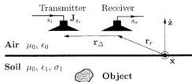

2714

IEEE TRANSACTIONS ON GEOSCIENCE AND REMOTE SENSING, VOL. 39, NO. 12, DECEMBER 2001

Fig. 1. Fixed-offset GPR configuration. The offset is described by the vector $\mathbf{r}_{\Delta} = \mathbf{R}_{\Delta} + \hat{\mathbf{z}} z_{\Delta}$.

in permittivity (i.e., the difference between the permittivities of the object and the soil) times the frequency is either much larger or much smaller than the contrast in conductivity. The first case is considered in Section III, except in Section III-F in which the second case applies. Numerical results for the 2.5-dimensional (2.5-D) case involving a circular cylinder buried deep in lossy soil is presented in Section IV. Finally, Section V draws conclusions and makes suggestions for future research.

## II. FORWARD MODEL

Consider the configuration in Fig. 1 in which a planar interface separates air and soil. A Cartesian $xyz$ coordinate system is introduced such that the $xy$ plane coincides with the interface and such that $z > 0$ is air. The air has the permittivity $\epsilon_0$ and the permeability $\mu_0$, whereas the soil has the permittivity $\epsilon_1$, conductivity $\sigma_1$, and permeability $\mu_0$. The constitutive parameters $\epsilon_0, \epsilon_1, \sigma_1$, and $\mu_0$ are all assumed to be real quantities and independent of both position and frequency $\omega$ over the bandwidth of the transmitted fields $\omega_{\min} < \omega < \omega_{\max}$. Thus, the propagation constant of air is $k_0(\omega) = \omega \sqrt{\mu_0 \epsilon_0}$ and that of soil is $k_1(\omega) = \omega \sqrt{\mu_0 (\epsilon_1 + i \sigma_1 / \omega)}$. A fixed-offset GPR configuration is considered in which the position of the receiving antenna is described by the vector $\mathbf{r}_r = \mathbf{R}_r + \hat{\mathbf{z}} z_r$ with $z_r \geq 0$. The position of the transmitting antenna is $\mathbf{r}_t = \mathbf{r}_r + \mathbf{r} \Delta D \epsilon t t a$ with the offset $\mathbf{r}_{\Delta} = \mathbf{R}_{\Delta} + \hat{\mathbf{z}} z_{\Delta}$ kept constant. The forward model to be presented in this section gives an expression for the output $s_o$ of the receiving antenna that is solely due to the field scattered by the buried object. Hence, $s_o$ does not include contributions from the reflection in the interface and from the direct field from the transmitting antenna. In [4], the first Born approximation and a plane-wave expansion of the dyadic Green function $\mathbf{G}(\mathbf{r}, \mathbf{r}', \omega)$ for a two-layer medium were used to derive an expression for the output $s_o$ when both the transmitting and receiving antennas are ideal dipoles [4, (12)]. In the following, a similar expression for $s_o$, valid for arbitrary transmitting and receiving antennas, is derived. To this end, the background field $\mathbf{E}_b$ in the soil, radiated by the transmitting antenna described by the current density $\mathbf{J}_{s_i}(\mathbf{r} - \mathbf{r}_t)^1$, is needed

$$\begin{aligned} \mathbf{E}_b(\mathbf{r}', \omega) &= i \omega \mu_0 \int_{-\infty}^{\infty} d^3\mathbf{r} \mathbf{G}(\mathbf{r}', \mathbf{r}, \omega) \\ &\quad \cdot \mathbf{J}_{s_i}(\mathbf{r} - \mathbf{r}_t) \\ &= i \omega \mu_0 \int_{-\infty}^{\infty} d^3\mathbf{r} \mathbf{J}_{s_i}(\mathbf{r} - \mathbf{r}_t) \\ &\quad \cdot \mathbf{G}(\mathbf{r}, \mathbf{r}', \omega) \quad z' < 0 \end{aligned} \quad (1)$$

$^1$The subscript $s_i$ on $\mathbf{J}_{s_i}$ indicates that the current density depends on the input signal $s_i$. The form of this dependence can be either measured or calculated. This matter is, however, not the concern of the present paper.

where the reciprocity relation $\mathbf{G}(\mathbf{r}', \mathbf{r}, \omega) \cdot \mathbf{J}_{s_i} = \mathbf{J}_{s_i} \cdot \mathbf{G}(\mathbf{r}, \mathbf{r}', \omega)$ is used. The dyadic Green function is written as a plane-wave spectrum as

$$\begin{aligned} \mathbf{G}(\mathbf{r}, \mathbf{r}', \omega) &= \frac{i}{8\pi^2} \int_{-\infty}^{\infty} d^3\mathbf{K}' \mathbf{F}(\mathbf{K}', \omega) \\ &\quad \cdot \exp(i \mathbf{k}_0(\mathbf{K}', \omega) \cdot \mathbf{r} - \mathbf{k}_1(\mathbf{K}', \omega) \cdot \mathbf{r}') \\ &\quad z > 0, z' < 0. \end{aligned} \quad (2)$$

In this expression, $\mathbf{k}_0(\mathbf{K}, \omega) = \mathbf{K} + \hat{\mathbf{z}} \gamma_0(\mathbf{K}, \omega)$, $\mathbf{K} = \hat{\mathbf{x}} k_x + \hat{\mathbf{y}} k_y$, $\gamma_0(\mathbf{K}, \omega) = \sqrt{k_0^2(\omega) - |\mathbf{K}|^2}$, and similarly for $\mathbf{k}_1(\mathbf{K}, \omega)$. The square roots in $\gamma_0$ and $\gamma_1$ have nonnegative real and imaginary parts. The dyadic $\mathbf{F}$ in (2), that accounts for the interface, is [4, (6)]

$$\begin{aligned} \mathbf{F}(\mathbf{K}, \omega) &= \frac{2}{(\gamma_0 + \gamma_1)(k_x^2 + k_y^2 + \gamma_0 \gamma_1)} \\ &\quad \cdot \left[ \hat{\mathbf{x}} \left( (k_y^2 + \gamma_0 \gamma_1) \hat{\mathbf{x}} - k_x k_y \hat{\mathbf{y}} \right. \right. \\ &\quad \left. \left. - k_x \gamma_0 \hat{\mathbf{z}} \right) \right. \\ &\quad + \hat{\mathbf{y}} \left( -k_x k_y \hat{\mathbf{x}} + (k_x^2 + \gamma_0 \gamma_1) \hat{\mathbf{y}} \right. \\ &\quad \left. - k_y \gamma_0 \hat{\mathbf{z}} \right) \\ &\quad + \hat{\mathbf{z}} \left( -k_x \gamma_1 \hat{\mathbf{x}} - k_y \gamma_1 \hat{\mathbf{y}} \right. \\ &\quad \left. \left. + (k_x^2 + k_y^2) \hat{\mathbf{z}} \right) \right] \end{aligned} \quad (3)$$

where it has not been explicitly indicated that $\gamma_0$ and $\gamma_1$ depend on $\mathbf{K}$ and $\omega$. When there is no interface, i.e., $k_1(\omega) = k_0(\omega)$, (3) reduces to $\mathbf{F}(\mathbf{K}, \omega) = (\mathbf{I} - \mathbf{k}_1(\mathbf{K}, \omega) \mathbf{k}_1(\mathbf{K}, \omega) / k_1^2(\omega)) / \gamma_1(\mathbf{K}, \omega)$. Inserting the plane-wave expansion (2) of the dyadic Green function into the expression (1) for the background field, one obtains

$$\begin{aligned} \mathbf{E}_b(\mathbf{r}', \omega) &= \frac{-\omega \mu_0}{8\pi^2} \int_{-\infty}^{\infty} d^3\mathbf{K}' \exp(-i \mathbf{k}_1(\mathbf{K}', \omega) \cdot \mathbf{r}') \\ &\quad \cdot \exp(i \mathbf{k}_0(\mathbf{K}', \omega) \cdot [\mathbf{r}_r + \mathbf{r}_{\Delta}]) \\ &\quad \cdot \mathbf{J}_{s_i}(-\mathbf{k}_0(\mathbf{K}', \omega)) \cdot \mathbf{F}(\mathbf{K}', \omega) \end{aligned} \quad (4)$$

where the relation $\mathbf{r}_t = \mathbf{r}_r + \mathbf{r}_{\Delta}$ has been employed. The quantity $\mathbf{J}_{s_i}$ is a spatial FT of the current density describing the transmitting antenna

$$\mathbf{J}_{s_i}(\mathbf{k}) = \int_{-\infty}^{\infty} d^3\mathbf{r} \mathbf{J}_{s_i}(\mathbf{r}) \exp(-i \mathbf{k} \cdot \mathbf{r}). \quad (5)$$

Using the first Born approximation, the scattered field $\mathbf{E}_s(\mathbf{r}_r, \omega)$, due to the presence of the buried object, is explicitly expressed in terms of the background field $\mathbf{E}_b$ as

$$\mathbf{E}_s(\mathbf{r}_r, \omega) = i \omega \mu_0 \int_{z' < 0} d^3\mathbf{r}' \mathbf{G}(\mathbf{r}_r, \mathbf{r}', \omega) \cdot \mathbf{E}_b(\mathbf{r}', \omega) O(\mathbf{r}', \omega) \quad (6)$$

where the object function $O(\mathbf{r}', \omega)$ is defined as

$$O(\mathbf{r}', \omega) = \sigma(\mathbf{r}') - \sigma_1 - i \omega(\epsilon(\mathbf{r}') - \epsilon_1) = \Delta \sigma(\mathbf{r}') - i \omega \Delta \epsilon(\mathbf{r}'). \quad (7)$$

Using this expression (6) for the scattered field, the plane-wave spectrum (2) of the dyadic Green function and the plane-wave

Authorized licensed use limited to: Danmarks Tekniske Informationscenter. Downloaded on March 23, 2010 at 10:16:38 EDT from IEEE Xplore. Restrictions apply.